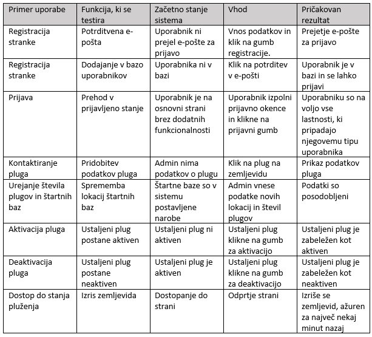

# Celovita rešitev organizacije pluženja

### Jošt Eržen, Filip Gros, Sebastjan Kordiš, Matevž Vidovič

## 1 Uvod

Ob novozapadlem snegu se promet skoraj ustavi. Organizacije, ki se ukvarjajo s pluženjem, se na vso moč trudijo, da se situacija ne poslabša do te mere, da bi postala totalen prometni kolaps.
Naš projekt želi biti celovita rešitev organizacije pluženja, da lahko s tem pomagamo pri koordinaciji in nadzorovanju le tega ter z algoritmičnimi pristopi pluženje naredimo učinkovitejše. Poleg tega želimo povezati pravne in fizične osebe, ki potrebujejo pluženje parkirišč in dvorišč, z izvajalci pluženja, kot so kmetje, da lahko zunaj plužne konice omogočimo to storitev, ki koristi obema stranema.
Tako postanejo Vaši stroški pluženja nižji, občani pa so bolj zadovoljni, saj lahko kljub snegu normalno potujejo. Občani bodo zadovolni tudi s spremljanjem pluženja v realnem času, saj bodo tako lahko videli, kdaj je pot, na katero se odpravljajo splužena, in lahko tudi vidijo, da bo do tega tudi prišlo in niso pozabljeni. Največji vpliv pa zna imeti povezovanje pomoči potrebnih in samostojnih plugov, ki skupnosti omogoči, da se s snegom spopade kot celota in ne kot skupek posameznikov.

### 1.2 Poudarki

Želeli smo dokončno določiti svojo vizijo in preveriti njeno izvedljivost. Pregledali smo razpoložljive podatke ter ugotovili, kako jih lahko predpripravimo za učenje algoritma. Ustvarili smo tudi osnovno funkcionalnost prijave in definirali zaslonske maske ter funkcionalnosti.

### 1.3 Spremembe

Iz večjega osredotočenja na algoritem organizacije pluženja smo postopoma pozornost v večji meri preusmerili na funkcionalnosti povezane z organizacijo samostojnih plugov za opravljanje dodatnih del.

## 2 Potrebe naročnika
Podjetji, ki opravljata pluženje, si želita intuitiven in zanesljiv nadzor nad situacijo pluženja, ter zmanjšane stroške pluženja zaradi višje učinkovitosti.
Občani in lokalna podjetja želijo možnost kontakta s kmeti, ki bi bili pripravljeni pomagati pri pluženju dvorišč in parkirišč, saj je to za večje površine izvajati ročno zelo zahtevno in zamudno, medtem ko kmet s plugom to nalogo opravi zelo hitro. Kmetje s plugom pa si želijo dostopa do nove potencialne storitvene dejavnosti.
Sistem mora vsakemu od deležnikov biti preprost za uporabo, brez nepotrebnih funkcionalnosti, zaradi katerih bi postal zapleten. Sistem mora biti robusten, saj, če se deležniki nanj zanašajo, njegova napaka lahko povzroči prometni kolaps.

## 3 Cilji projekta

Projekt bo samodejno organiziral pluženje po približku optimalnega načrta plužnih poti. Poti bo spremenil ob sprotnem dodajanju in odvemanju plugov, kar naročniku omogoča večjo prilagodljivost. Na ta način bo zmanjšal stroške goriva dela, ter občanom izboljšal izkušnjo s prometom na dni sneženja.
Z delom aplikacije, ki samostojnim plugom omogoča povezovanje s pravnimi in fizičnimi osebami za pluženje parkirišč in dvorišč, bomo izboljšali kaotično stanje, ki nastane ob novozapadlem snegu. Tako bo delo lažje organizirano in razporejeno, saj se ne bo vsako podjetje potrebovalo dogovarjati z določenim opravljalcem plužnih storitev, da to poskrbi za njih. Prav tako lahko pomaga šibkejšim članom družbe, naprimer starejšim, ki svojih dvorišč ne morejo očistiti sami, kar povzroča tudi poledico in nevarnost poškodbe zaradi padca.

### 3.1 Primeri uporabe

##### Slovar pojmov

UI - uporabniški vmesnik (User Interface). Je grafična podoba in osnovno delovanje spletne strani.
Baza - podatkovna baza, baza podatkov.

#### 3.1.1 Akterji, katere funkcionalnosti imajo na voljo.

Poznamo 6 vrst akterjev.
Neregistriran uporabnik je vsakdo, ki obišče osnovno spletno stran. Vidi lahko zemljevid stanja spluženosti cest in ima možnost registracije, da postane Stranka.
Admin je glavni upravitelj s sistemom. Njegova glavna naloga je upravljanje s štartnimi bazami pluženja in dodajanje novih akterjev (razen teh tipa Stranka).
Ustaljeni plug predstavlja plug znotraj obstoječega sistema pluženja, Samostojni plug pa je neodvisen delavec, ki pomaga pri pluženju, kot so pogosto kmetje, ki jim je pluženje dodatna dejavnost.
Stranka je lahko vsakdo, ki želi oddati zahtevek za pluženje neke površine na področju MOC. To so lahko fizične ali pravne osebe.
Manager pluženja opravlja koordinacijo plugov pri napotitvah na zahtevke za pluženje.

Akterjem je na voljo 12. funkcionalnosti, ki v ozadju uporabljajo še 8 podpornih funkcionalnosti. Določenemu tipu akterja je dostopen določen nabor funkcionalnosti. Ta nabor je predstavljen s terko številk.Oštevilčenost funkcionalnosti je na voljo spodaj.

Neregistriran uporabnik: (1, 2)
Admin: (1, 3, 4, 5, 10, 11, 12)
Ustaljeni plug (3, 6, 7, 9, 12)
Stranka (1, 3, 8, 12)
Samostojni plug (3, 9, 12)
Manager pluženja (1, 3, 4, 10, 12)

Uporabniške funkcionalnosti:
1. Dostop do stanja pluženja 
2. Registracija Stranke
3. Prijava
4. Kontaktiranje pluga
5. Urejanje števila plugov in štartnih baz
6. Aktivacija pluga
7. Deaktivacija pluga
8. Oddaja zahtevka za pluženje
9. Izbira naloge pluženja
10. Usmeritev Samostojnega pluga
11. Registracija osebja
12. Pridobitev pozabljenega gesla

Podporne funkcionalnosti:
13. Poskus registracije
14. Potrditev registracije
15. Posodobitev štartnih baz
16. Potrditev (de)aktivacije
17. Dodajanje zahtevka
18. Izbira zahtevka
19. Dodajanje uporabnika
20. Pozabljeno geslo

#### 3.1.2 Primeri uporabe

Business value ocenjujemo na skali od 1 do 10, kjer 1 pomeni “zelo majhna poslovna vrednost” in 10 pomeni “ogromna poslovna vrednost”.
Pogostost uporabe ocenjujemo na skali od 1 do 10, kjer 1 pomeni “skoraj nikoli uporabljeno” in 10 pomeni “uporabljeno ves čas”.

##### 1. Dostop do stanja pluženja (MUST HAVE)
Dostop do stanja pluženja uporabniku izriše zemljevid pluženja, kjer so cest pobarvane glede na zasneženost oziroma čas od zadnjega pluženja, ter so vidne trenutne lokacije plugov.
Business value: 8
Pogostost uporabe: 10

Osnovni tok:
1. Uporabnik dostopa do začetne spletne strani sistema.
2. Kot del strani se izriše zemljevid stanja pluženja.

##### 2. Registracija Stranke (SHOULD HAVE)
Neregistriran uporabnik se lahko registrira v sistem in tako postane Stranka.
Business value: 6
Pogostost uporabe: 2

Osnovni tok:
1. Uporabnik dostopa do začetne spletne strani sistema.
2. Uporabnik klikne na gumb “Registracija”.
2. Izriše se registracijsko okno.
3. Uporabnik vnese svoje podatke (e-poštni naslov, uporabniško ime, geslo), pri čemer geslo vnese dvakrat, ter klikne na gumb “Registriraj me”.
4. Sproži se tok dogodkov primera uporabe “Poskus registracije”.
5. Primer uporabe “Poskus registracije” vrne sporočilo o uspešnosti.
6. Uporabnik je preusmerjen na začetno spletno stran sistema.
7. Sproži se tok dogodkov primera uporabe “Potrditev registracije”

Predpogoj: Uporabnik še ni registriran v sistem kot Stranka.
Popogoj: Uporabnik prejme e-poštno sporočilo, kjer lahko potrdi prijavo.

Alternativni tok:
Če na koraku 5 “Poskus registracije” vrne sporočilo, da registracija ni uspešna, uporabnika obvesti o napaki. (Primer: “Uporabnik s tem e-poštnim naslovom že obstaja). Tok se zaključi.

##### 3. Prijava (MUST HAVE)
Prijava obstoječim uporabnikom omogoči vstop v sistem in dostop do funkcionalnosti, ki so namenjene njihovemu tipu uporabnika.
Business value: 10
Pogostost uporabe: 8

Osnovni tok:
1. Uporabnik dostopa do začetne spletne strani sistema.
2. Kot del strani se izriše prijavno okno.
3. Uporabnik vnese prijavne podatke ter klikne na gumb “Prijava”.
4. Zalednemu sistemu je poslan zahtevek za prijavo.
5. Zaledni sistem vrne sporočilo o sprejetju prijave.
6. Uporabnik je preusmerjen na spletno stran, ki je primerna njegovemu tipu uporabnika.

Predpogoj: Uporabnik je potrjeno registriran.
Popogoj: Uporabnik lahko uporablja funkcionalnosti, ki so na voljo njegovemu tipu uporabnika.

Alternativni tok:
Če je koraku 5 vrnjeno sporočilo o zavrnitvi prijave, se o tem izpiše obvestilo. (Primer: “V podanem uporabniškem imenu ali geslu je prisotna napaka.”) Tok se zaključi.

##### 4. Kontaktiranje pluga (COULD HAVE)
Admin in Manager preko uporabe Kontaktiranje pluga pridobita kontaktne podatke izbranega pluga.
Business value: 2
Pogostost uporabe: 2

Osnovni tok:
1. Admin/Manager na strani Admin UI/Manager UI klikne na enega od plugov na zemljevidu ali enega od plugov v tabeli deaktiviranih plugov.
2. Odpre se okno s kontaktnimi podatki izbranega pluga.

Predpogoji:
Uporabnik je prijavljen kot Admin ali Manager.

##### 5. Urejanje števila plugov in štartnih baz (COULD HAVE)
Primer uporabe omogoča Admin-u, da spremeni lokacije štartnih baz in število plugov, ki posamezni bazi pripadajo. Tako vpliva na algoritem izbire najboljših poti.
Business value: 4
Pogostost uporabe: 2

Osnovni tok:
1. Admin na strani Admin UI klikne na gumb “Uredi štartne baze”.
2. Izriše se okno s tabelo štartnih baz, njihovih lokacij ter njihovo številčnostjo pripadajočih plugov.
3. Admin v oknu ureja podatke in klikne na gumb “Shrani”.
4. Izrisano okno s tabelo štartnih baz se zapre. 
5. Sproži se tok dogodkov primera uporabe “Posodobitev štartnih baz”.
6. Primer uporabe “Posodobitev štartnih baz” vrne sporočilo o uspešnosti, ki se uporabniku izpiše.

Predpogoj: Uporabnik je prijavljen kot Admin.
Popogoj: Podatki štartnih baz so posodobljeni.

##### 6. Aktivacija pluga (SHOULD HAVE)
Ustaljeni plug preko Aktivacija pluga svoj plug vrne v med aktivne pluge v stanju pluženja, če je bil predhodno deaktiviran.
Business value: 4
Pogostost uporabe: 3

Osnovni tok:
1. Ustaljeni plug na Plug UI klikne na gumb “Aktivacija”.
2. Sproži se tok dogodkov primera uporabe “Potrditev (de)aktivacije”.
3. Primer uporabe “Potrditev (de)aktivacije” vrne sporočilo o uspešnosti, ki se uporabniku izpiše.
4. Gumb “Aktivacija” se spremeni v gumb “Deaktivacija”

Predpogoji:
Uporabnik je prijavljen kot Ustaljeni plug.
Ustaljeni plug je deaktiviran.

Popogoj: Ustaljeni plug je dodan na seznam aktivnih plugov.

Alternativni tok:
Če na koraku 3 “Potrditev (de)aktivacije” vrne sporočilo, da aktivacija ni uspešna, se o tem izpiše obvestilo. Tok se zaključi.

##### 7. Deaktivacija pluga (SHOULD HAVE)
Ustaljeni plug izvzame svoj plug vrne iz stanja pluženja.
Business value: 4
Pogostost uporabe: 2

Osnovni tok:
1. Ustaljeni plug na Plug UI klikne na gumb “Deaktivacija”.
2. Sproži se tok dogodkov primera uporabe “Potrditev (de)aktivacije”.
3. Primer uporabe “Potrditev (de)aktivacije” vrne sporočilo o uspešnosti, ki se uporabniku izpiše.
4. Gumb “Deaktivacija” se spremeni v gumb “Aktivacija”

Predpogoji:
Uporabnik je prijavljen kot Ustaljeni plug.
Ustaljeni plug je aktiviran.

Popogoj: Ustaljeni plug je odstranjen iz seznama aktivnih plugov.

Alternativni tok:
Če na koraku 3 “Potrditev (de)aktivacije” vrne sporočilo, da deaktivacija ni uspešna, se o tem izpiše obvestilo. Tok se zaključi.

##### 8. Oddaja zahtevka za pluženje (SHOULD HAVE)
Primer uporabe omogoči Stranki, da je njihov zahtevek dodan v bazo trenutnih zahtevkov.
Business value: 6
Pogostost uporabe: 5

Osnovni tok:
1. Stranka na Stranka UI v okno zahtevka vnese podatke zahtevka ter klikne na gumb “Oddaj zahtevek”.
2. Sproži se tok dogodkov primera uporabe “Dodajanje zahtevka”.
3. Primer uporabe “Dodajanje zahtevka” vrne sporočilo o uspešnosti, ki se uporabniku izpiše.

Predpogoj: Uporabnik je prijavljen kot Stranka.
Popogoj: Zahtevek je dodan med trenutne zahtevke.

##### 9. Izbira naloge pluženja (SHOULD HAVE)

Samostojni plug ali Ustaljeni plug prevzame opravljanje zahtevka pluženja, ki je odstranjen iz baze trenutnih zahtevkov.
Business value: 6
Pogostost uporabe: 3

Osnovni tok:
1. Samostojni plug ali Ustaljeni plug klikne na gumb “Izberi nalogo”.
2. Odpre se okno z nalogami, ki so na voljo, in so uporabniku blizu po geolokaciji.
3. Uporabnik označi nalogo in klikne na gumb “Izberi”.
4. Okno z nalogami se zapre.
5. Sproži se tok dogodkov primera uporabe “Izbira zahtevka”.
6. Primer uporabe “Izbira zahtevka” vrne sporočilo o uspešnosti, ki se uporabniku izpiše.

Predpogoj: Uporabnik je prijavljen kot Samostojni plug ali Ustaljeni plug.

Popogoj: Zahtevek je odstranjen iz trenutnih zahtevkov.

##### 10. Usmeritev Samostojnega pluga (COULD HAVE)
Admin ali Manager lahko napotita Samostojni plug na nalogo iz množice trenutnih zahtevkov, če opazita, da je ta res nujna.
Business value: 1
Pogostost uporabe: 2

Osnovni tok:
1. Uporabnik klikne na plug na izrisanem zemljevidu.
2. Poleg kontaktnih podatkov se pojavi gumb “Usmeri”, ki ga klikne.
3. Izbranemu plugu je na njegov UI dodano rdeče obvestilo o usmeritvi z gumbom “Sprejmi”. Klikne ga takoj, ko lahko.
4. Sproži se tok dogodkov primera uporabe “Izbira zahtevka”.
5. Primer uporabe “Izbira zahtevka” vrne sporočilo o uspešnosti, ki se izbranemu plugu izpiše.
6. Izbranemu plugu se iz UI odstrani rdeče obvestilo.

Predpogoj: Uporabnik je prijavljen kot Admin ali Manager in izbrani plug je prijavljen kot Samostojni plug ali Ustaljeni plug.

Popogoj: Zahtevek je odstranjen iz trenutnih zahtevkov.

##### 11. Registracija osebja (MUST HAVE)
Admin lahko v sistem doda kateregakoli od akterjev.
Business value: 10
Pogostost uporabe: 2

Osnovni tok:
1. Admin klikne na gumb “Dodaj uporabnika”.
2. Izriše se okno v katerem lahko izbere tip uporabnika in vnese njegove podatke. Klikne na gumb “Dodaj”.
3. Sproži se tok dogodkov primera uporabe “Dodajanje uporabnika”.
4. Primer uporabe “Dodajanje uporabnika” vrne sporočilo o uspešnosti, ki se izpiše.

Predpogoj: Uporabnik je prijavljen kot Admin.
Popogoj: Uporabniški profil je dodan v sistem.

Alternativni tok:
Če na koraku 3 “Dodajanje uporabnika” vrne sporočilo, da dodajanje ni uspešno, se le-to izpiše.

##### 12. Pridobitev pozabljenega gesla (MUST HAVE)
Če uporabnik pozabi geslo ga lahko pridobi preko e-pošte.
Business value: 10
Pogostost uporabe: 4

Osnovni tok:
1. Uporabnik klikne na gumb “Pozabil sem geslo”.
2. Izriše se okno za vnos e-poštnega naslova. Uporabnik klikne na gumb “Potrdi”.
3. Sproži se tok dogodkov primera uporabe “Pozabljeno geslo”.
4. Primer uporabe “Pozabljeno geslo” vrne sporočilo o uspešnosti, ki se izpiše.

Predpogoj: Uporabnik je predhodno že bil dodan v bazo uporabnikov.
Popogoj: Uporabnik je prejel e-pošto z geslom.

 Podporne funkcionalnosti:

##### 13. Poskus registracije (SHOULD HAVE)
Poskus registracije uporabnika pripravi, da lahko potrdi svojo registracijo.
Business value: 6
Pogostost uporabe: 2

Osnovni tok:
1. Dobimo zahtevek za registracijo s podatki o uporabniku.
2. Preverimo, če uporabnik s tem e-poštnim naslovom že obstaja.
3. Dodamo ga v bazo še nepotrjenih uporabnikov.
4. Vrnemo sporočilo o uspešnem vpisu.

Popogoj: Uporabnik je vpisan v bazo nepotrjenih uporabnikov.

Alternativni tok:
Če v koraku 2 ugotovimo, da je uporabnik že v naši bazi, vrnemo sporočilo o neuspelem vpisu.

##### 14. Potrditev registracije (SHOULD HAVE)
Potrditev registracije zaključi registracijo uporabnika po tem, ko jo je potrdil na prejetem e-poštnem sporočilu.
Business value: 6
Pogostost uporabe: 2

Osnovni tok:
1. Zaledni sistem pošlje e-poštni naslov uporabnika.
2. Preverimo, če je uporabnik s takšnim e-pošnim naslovom prisoten v bazi nepotrjenih uporabnikov, ter pridobimo njegove ostale podatke.
3. Sproži se tok dogodkov primera uporabe “Dodajanje uporabnika”.
4. Primer uporabe “Dodajanje uporabnika” vrne sporočilo o uspešnosti.
5. Uporabnika odstranimo iz baze še nepotrjenih uporabnikov.
6. O uspešni prijavi ga obvestimo na e-poštni naslov.

Predpogoji:
Uporabnik je vpisan v bazo nepotrjenih uporabnikov.
Uporabnik še ni vpisan v bazo uporabnikov.

Popogoj: Uporabnik je vpisan v bazo uporabnikov.

Alternativni tokovi:
Če v koraku 2 ugotovimo, da uporabnik še ni v naši bazi uporabnikov, ga na e-poštni naslov opozorimo o nenavadnem delovanju. Tok se ustavi.
Če v koraku 4 dobimo sporočilo o neuspešnem dodajanju, uporabniku na e-pošto posredujemo vzrok napake. Tok je zaključen.

##### 15. Posodobitev štartnih baz (COULD HAVE)
V zaledju se spremenijo podatki o štartnih bazah.
Business value: 4
Pogostost uporabe: 2

Osnovni tok:
1. Dobimo podatke o željeni spremembi podatkov o štartnih bazah.
2. V bazi spremenimo podatke.
3. Vrnemo sporočilo o uspešnosti.

Popogoj: Podatki o štartnih bazah so posodobljeni.

Alternativni tokovi:
Če je sprememba podatkov v koraku 2 neuspešna, vrnemo sporočilo o neupešni spremembi.

##### 16. Potrditev (de)aktivacije (SHOULD HAVE)
Sprememba stanja aktivnosti pluga.
Business value: 4
Pogostost uporabe: 5

Osnovni tok:
1. Dobimo zahtevek za spremembo, ki vsebuje šifro pluga in željeno stanje (aktiviran/deaktiviran).
2. Preverimo trenutno stanje pluga.
3. Spremenimo stanje pluga.
4. Vrnemo sporočilo o uspešni spremembi.

Predpogoj: Plug je že zaveden v bazi.
Popogoj: Stanje pluga je enako kot v zahtevku.

Alternativni tokovi:
Če v koraku 2 ugotovimo, da je trenutno stanje že enako željenemu stanju, vrnemo sporočilo o uspehu, ter sporočilu dodamo, da se stanje ni spremenilo.
Če v koraku 2 ugotovimo, da plug ni zaveden v bazi, vrnemo sporočilo o neuspehu ter povemo, da pluga ni v bazi.
Če v koraku 3 ne uspemo spremeniti stanja pluga, vrnemo sporočilo o neupehu, kjer dodamo, da je prišlo do neznane napake in naj uporabnik poskusi kasneje.

##### 17. Dodajanje zahtevka (SHOULD HAVE)
Zahtevek za pluženje je dodan med trenutne zahtevke.
Business value: 6
Pogostost uporabe: 5

Osnovni tok:
1. Dobimo podatke zahtevka.
2. Preverimo, da uporabnik, ki je zaveden na zahtevku, res obstaja.
3. Zahtevek dodamo na seznam trenutnih zahtevkov.
4. Vrnemo sporočilo o uspehu.

Predpogoj: Uporabnik v podatkih zahtevka je vpisan v bazo Strank.
Popogoj: Zahtevek je dodan med trenutne zahtevke.

Alternativni tokovi:
Če v koraku 2 ugotovimo, da uporabnik še ni v naši bazi Strank, ali v koraku 3 ne moremo dodati zahtevka na seznam trenutnih zahtevkov, vrnemo sporočilo o neuspetju. Tok se ustavi.

##### 18. Izbira zahtevka (SHOULD HAVE)
Plug je izbral zahtevek, zato zahtevek ne bo več na voljo.
Business value: 6
Pogostost uporabe: 3

Osnovni tok:
1. Dobimo identifikator zahtevka in podatke o plugu.
2. Preverimo, da je zahtevek na seznamu trenutnih zahtevkov in da plug res obstaja.
3. Z namenom deaktivacije se sproži tok dogodkov primera uporabe “Potrditev (de)aktivacije”.
4. Primer uporabe “Potrditev (de)aktivacije” vrne sporočilo o uspešnosti.
5. Preverimo, da je zahtevek še vedno na seznamu trenutnih zahtevkov.
6. Zahtevek odstranimo iz trenutnih zahtevkov.
7. Zahtevek dodelimo plugu.
8. Vrnemo sporočilo o uspešnosti.

Predpogoji:
Zahtevek je na seznamu trenutnih zahtevkov.
Plug je v bazi plugov.

Popogoji:
Zahtevek ni več med trenutnimi zahtevki.
Plug je deaktiviran.

Alternativni tokovi:
Če v koraku 2 odkrijemo napako, vrnemo sporočilo o neuspešnosti z navedenim razlogom.
Če v koraku 3 dobimo sporočilo o neuspešnosti, vrnemo sporočilo o neuspešnosti z navedenim razlogom.
Če v koraku 5 ugotovimo, da zahtevek ni več na voljo, vrnemo sporočilo o neuspešnosti in opozorimo plug, da je morda bil deaktiviran kljub neuspetju pridobitve zahtevka.

##### 19. Dodajanje uporabnika (MUST HAVE)
Admin lahko dodaja vse vrste uporabnikov.
Business value: 10
Pogostost uporabe: 2

Osnovni tok:
1. Dobimo zahtevek za dodajanje uporabnika.
2. Uporabnika dodamo v bazo.
3. Vrnemo sporočilo o uspešnosti.

Popogoj: Novi uporabnik je prisoten v bazi uporabnikov.

Alternativni tokovi:
Če v koraku 2 ugotovimo, da je uporabnik že prisoten, uspešnemu sporočil dodamo obvestilo, da je uporabnik že predhodno obstajal.

##### 20. Pozabljeno geslo (MUST HAVE)
Pošiljanje pozabljenega gesla na e-pošto uporabnika.
Business value: 10
Pogostost uporabe: 4

Osnovni tok:
1. Dobimo zahtevek o pozabljenem geslu z e-pošto uporabnika.
2. Dobimo geslo iz baze uporabnikov.
3. Pošljemo geslo in uporabniško ime na e-poštni naslov.
4. Vrnemo sporočilo o uspešnosti.

Popogoj: Uporabnik s takšno e-pošto obstaja v bazi uporabnikov.

Alternativni tokovi:
Če v koraku 2 ugotovimo, da takšnega uporabnika ni, prekinemo tok.

#### 3.1.3 Sprejemni testi

### 3.1.4 Diagram primerov uporabe
PRVI GRAF

 

DRUGI GRAF

TRETJI GRAF

#### 3.1.5 Nefunkcionalne zahteve

Sistem mora delovati za simultano organizacijo do 100 plugov.
Plug pa je avtomatsko voden v smeri njemu začrtanega pluženja. Posodabljanje informacij se dogaja v realnem času, torej se za potrebe pluženja mora posodobiti v največ eni minuti od zadnje spremembe stanja plugov na cestah in sprememb informacij o štartnih bazah.
Zemljevid stanja na cestah je na voljo tudi neregistriranim uporabnikom in prikazuje stanje za največ 5 minut nazaj.
V okviru organizacije opravljanja zahtevkov za pluženje moramo v primeru MOC omogočati hranjenje vsaj 30.000 zahtevkov naenkrat.
Omogočati moramo registriranost za vsaj 70.000 strank, ter hkratno prijavljenost za vsaj 5000 strank.

## 4 Opis sistema

*P.S. s črtkano črto so označene neobvezne ali pa priporočkjive razširitve sistema

Predstavitev sistema glede na diagram:
Na zgornjem diagramu je površinsko predstavljen sistem, ki ga želimo implementirati. Sistem lahko razdelimo na “Front-End”, ki je predstavljen v paketu UI, ter “Back-end”, ki obsega 2 glavna modula.
- SnowOnRoads Service predstavlja podatke, ki na zemljevid mestne občine Celje proecira višino snežne odejo na vsaki izmed cest. Upošteva, kdaj se je nazadnje peljal mimo plug, kjer ob njegovem mimohodu ponastavimo višino snega na 0 cm.
- Plow navigation algorithm pa je srce našega problema. Na podlagi stanja snega, prestavljenega z zgoraj opisanim servisom, izračuna najoptimalenjšo pot pluženja za vsakega voznika (na grafu Ustaljeni plug) podjetja VOC in Zelenice. Izračunano pot pošlje vozniku. Le administrator lahko vpliva na parametre algoritma (predstavljene v Manager UI). Algoritem upošteva vnaprej določeno prioritetno lestvico cest, kar v grobem pomeni da bodo državne, regionalne in medkrajvne ceste prej splužene kot stranske ulice. Ob intenzivnem sneženju se lahko zgodi, da bodo te ceste splužene večkrat, medtem ko bodo nekatere stranske ulice ostale nedotaknjene.
- Plowing orders so ena izmed možnih razširitev sistema, ki jih sistem po našem mnenju naj bi vseboval (Should have). Občan, ki se je registriral, lahko postane stranka, torej naročnik storitev pluženja. Ko se odloči, pošlje povpraševanje po storitvi. V najkrajšem možnem času mu vodja plužne izmene (manager) odobri ali zavrne storitev. Če je povpraševanje odobreno, se vključi v Plow navigation Algorithm, ali pa se direktno dodeli vozniku pluga, če ta nima trenutno aktivne poti pluženja. 
- TimeTillPlowArrive Service implementira funkcijonalnost povpraševanja po času, kdaj se željena ulica spluži. To ugotovimo na podlagi oddaljenosti plugov od ulice in njihovih plužnih poti. Je ena izmed opcijskih razširitev sistema (Could Have). 

Sistem je v osnovi zastavljen, da zadosti štirim ciljnim množicam.
- Občan predstavlja neregistriranega uporabnika. Ima dostop do zemljevida, na katerem je predstavljena trenutna snežna odeja na cestnem sistemu MOC
- Stranka je vsak občan, ki se je registriral. Lahko oddaja povpraševanja po storitvi pluženja. 
Manager povpraševanja odobri ali pa jih zavrne. Ima pregled nad strenutnin stanjem, vključno z lokacijami plugov. Ob kliku na vsak plug, se mu razširi njegova entita. Tam so prikazani vsi koristni podatki o plugu in vozniku. 
- Voznik pluga (na grafu Ustaljeni plug) je zaposleni pri podjetju VOC ali Zelenice. Ob možni nadgradnji sistema je lahko to tudi kateri izmed lokalnih kmetov ali drugih oseb (na grafu Samostojni plug), ki imajo v privatni lasti mehanizacijo zmožno pluženja. Njigova glavna naloga je da plužijo po zagrtani poti.
- Admin predstavlja le en administrativni profil, ki ima vso moč nad sistemom.

## 5 Trenutno stanje

- Trenutno imamo narejen prijavni portal,

zaslonske maske za glavno stran,

stran za prijavljene stranke,

stran za administratorje,

stran za nadzornike pluženja,

stran za voznike plugov,

ter stran za samostojne voznike plugov.

Prav tako smo izvedli test izvedljivosti uporabe podatkov zemljevidov ter testirali delovanje podatkovne baze za prijavo.

## 6 Vodenje projekta

#### Dnevnik sprememb:
- 29.2. Začetni nabor idej za možne funkcionalnosti. Zažetek projekta.
- 7.3. Omejitev idej, ki jih želimo podpirati. Želeli smo utrditi svojo vizijo projekta s povečanjem fokusa na manj idej. Napredovali smo hitreje.
- 13.3. Ob stoječem sestanku smo dokončno razjasnili željene uporabniške zgodbe in arhitekturo. Želeli smo pojmovanja sistema združiti na enem mestu. Sedaj lahko definiramo potrebovane funkcionalnosti.
- 27.3. Odločitev za dodato uporabo Google Maps in delitev razvijalskih vlog za specifične dele sistema. Želeli smo si olajšati delo navigacije na kratkih razdaljah, saj bi težko dosegli raven uporabnosti, ki ga že ponuja Google Maps. To nam bo omogočilo lažje napredovanje s projektom.
- 28.3. Odločitev za hevristični algoritem. Sprva smo želeli napisati algoritem, ki bi iskal optimalne poti pluženja, a smo ugotovili, da je to prekompleksna naloga. V nadaljevanju bomo poskusili uporabiti hevristike, ki bodo našle dobre rešitve pluženja, četudi te ne bodo optimalne.
- 3.4. Odločitev za kasnejši razvoj algoritma. Ker se je uporabniška zgodba uvedbe samostojnih plugov zdela dobro sprejeta in nas razlikuje od ostalih ekip, smo se odločili, da damo poudarek na njen razvoj. Razvili jo bomo preden začnemo razvijati algoritem.

### Cilji nadaljnjih iteracij
V 3. Iteraciji imamo namen obsežno programirati, da sistem vzpostavimo na funkcionalno raven. Sistem mora v celoti delovati. Želimo, da je napisana programska koda delujoča, ni pa še potrebno da je najbolje urejena, saj jo bomo olepšali v 4. iteraciji.
V 4. Iteraciji imamo namen izvesti refactoring kode, da bo ta lažje dostopna za odpravljanje programskih hroščev. Nato imamo namen izvesti testiranje sistema kot celote ter odpraviti programske hrošče. Napisali bomo krajši program uvajanja novih uporabnikov v sistem in njegovo efektivnost preverili pri znancih brez tehničnega znanja. Tako bomo dobili vpogled v morebitne nejasnosti pri uporabi in jih naslovili. Napisali bomo tudi dokumentacijo za dele sistema, kjer je to nujno, saj tako olajšamo uvajanje razvijalcev, ki bi v prihodnosti projekt razvijali naprej in dodajali funkcionalnosti.

### 6.2.1 Projektni načrt

![Ganttov diagram](https://teaching.lavbic.net/plantuml/png/dLdTRgD65BxtKupQYswZhhjnicfQLLLPcpXi7MFX7tMtggoncTXZOCQ2WJQk-WXvY7sHNYNlrJC3XW4JuqI950UO-Rxpyvrp6FyQ2HoA5MP2eA_wyWzFa4lnAiJ1LwtMpv6uzyalBVL0BxsC_caX96X0VCg8-WUX0NpiSf-7wEkxZlnHLwyv4-bLM7SFb_wLAt7aPQi-uAMt2ddCt6mjkRfxV-TMTtn__U7Ax6RBuHU78V_h4BZqM41z4WcU4tmDrDBd4N6Vsw3MJf-krY8tzj_Mpzzd3cn57cLRBDstgEmaGimYk4MOQAsfIz0TvsB1_sxvcArYl28eybkjRSWtP2cGYbU4n9gWyn_56l4xT4qMOOp3UzHvrxbiHLZ4eOll8_0JoMneHO1MkTJwu-ni519t6z9jY1DoTeRU_81SHh_z4-48_J5opDwVoCSHeC5rMAsMdBSH5IJ4Ixh1PsTlEkVQ4cjYEkVxDHVeBq8yW6JkdZGMsRRVH8Z0PRcVjLlG42Ewsz44_Z34iBp0DWI1BpQILGdYymVBCVOOvoYrwbc8pCYL3t7SSXSB3z8RG7RuyO48Xb52Tp7swIwpfmm66_K7XHVgqJ961TwOyIJdZy2za8TRZ3o4_HKFgGXYYTFHSCP3UsOCFvfxeCvpPYasXvRn1K1ioEC3NQEGF7s102LLZ6prt377vl3ZIv7682RCF8fSSaUPYWz6J_yHVqD0OYbccaAw_yRcU68CVxCQmwKpAq1xEHP1yPQ7UC7eqnSFZDojkBkGSRoBcRUad66VoSjuNMDvpxosXX2YHWVdT3KFWmOp1Wn7u6iLrop_oO6F1yP9G3gZmsYwt8i3A0Rr49cpUdRtDHZMpYK-1g5jGVa-NyaFa3cUKBb_MH9QpnmOirngbqTZ9-deA0bn5nZoGeGysiBsDAcuJKyJnvmuTYb73ZMMaIam7B8ZOS8W8p4xsD3wV7Ix533RIsxMAHKrT5ZLEWrLBQryfRAMke1x8PCQ0K_lvGy-tsSLHX6KfO0_Fcmu6jtFd94ovPqUy4zmDRVcNNq9qj0b-EUqkb4Kubt2DsfnXG8FeQMdPOy0dnYqBEb0HOGowUCLHMkIoD95lMeATgVZYNqxDmPzsx4cDxSDjKJnrtoTfs14WzXF2J3i-PluyK6HX0O0MaS9Lvo03mgW-iJeBVAuWCyXzJcA8QsUlZ0E14kEpGoHdA_qIcJTJWV6nBA7UxPN9tdINcHasz5w2oi45yHJFBP5wyHGUA219NYZ2aLEvw0Stepc89XHGp-fKBZX0KH8ZW5JwoUKH6GH0yYE151x4wgMoiWjmKVV8P0qPTM0tTYtvdnaz1kgKXNOI0HK8UefLI333IXxgphq51R9mWyLT-J7AvvK3JMcanjpEB6w9O_NcrkGqv0b5fWB-xu5axmyIm7hE_Jq1RmFXa8dJs2OWgBVRhVBuJPwjzPmFhME5wyApG8_Dr3PX_gZCOhMEAHi1NoI239ELZIuNJmeoSdkw5DGSWIYutlY7ErIv_6WBHrreV64dUVZ6yEnXlsYmDHItHlqBCcf1Tna_v1gWfcIi1Z2bt8dA8WXGRSqWjG1GWmdtAM-obk6NTY6ST0Pv4y0efEY0akKZShptszniYDLxgF1jA-v-6JU4qZKhAKInaMxcgtJeJMPJw0L7y_MWogapGrP0yrGFEwITZL5ktRFr9jeVN8MN4fjEWv9AdLedlADAF9I5FGc97TuARXCbMyFB7FCQwCxiVLelzYsve6at3rW8faFpTydn-tKcRseZLUx-0bO1IMjALnK6_1LfG5V559-jW5tDEwpjA78IHXv0H6gMEpR0vHFDBExifPz9Zv8Q4cguy-ruToQplXu0Qc2EccxbV8_fTkgQ5tMTzRSXvSlpH07fWcGioXa5a4R9y12jgqbyQ65LQqTVnfFpDkIwXfnwwRAqkZw36xd4BTncDNvlKWBvtLQcFTcvl4SrNWroG4ghTWq3RSATjOvKHYAdoQEooPnN5R5KPUe5vefGnWGGv6zfaBXfuWHUFkWOIH22auDylSjZmVLMKfhMlFf45u0caUgChPgE9jyEcsIYQoZcIYd3dHiPzupPxahVtX9ml28ktoXYWACtIHOf0FabaSu83ivqCWngcYZm7BD4ovVug6SB6IxXGK7pSInZTvyP8zWn0GrVZeUPjq8BSYdoBPzHBTpUsOwnc1mNBzLfbfsCq5MAiSYhqIZck3obGNw7mpV6neSlZOE9sRVKGFL2UNaUJfrKy9btPGmltWjHCsOSF2gaqq91KZd-9mmlpXnKZXzL7WTjbr8gNZ7Lp3lIwS9zaUp2xdZQ32D8q89w8GXuQAs7BuAKBLsy9zqwKWxkL3wW57uyG57kRaPvCpkQTtqX4F9_HaZZT2I-nnYwCfHmI5WS7uaM7UpECSxiZG_WQlT8JyngxjREicgXT0Ee8vHK0stxe7YrAVkRdPGKtjB7hdKGgRd5tMt3WyI6fvwncVwy5BtGAbjr9Alrky6cABMrdkffDtwE9HqL_U8ojhAZO7yTg4V4i9QlqAggYzb_WS0 "Ganttov diagram")

*Ganttov diagram*

![PERT](https://teaching.lavbic.net/plantuml/png/fLVTSjf65BxNK-mq5sbdOkA20DlrU4R1igqf64O8TvBf3BEW1I-8NNNrquPE7Y4FaHVfLV9UFViZ40B7kBq1j6UrvpldxFc-GxAaBCO2hz04JvTpmJCMTdZ41Ke5PWcO24kjYCnIb78awFmnHI4LP9fIpYmhcUA8eDFQcMLT9kd7Y5nPIOfJSatnN1xwjuKG5eB_gNuXrAMCwECd4VY3jK_M9-lohNdNIZPmXl8OzTQx2h1Nv6pMd8NImaL8X5bjthmxSpjmMkcGaCnm5gK1-Ijr8ZfdAmW6JU632EjrQLjCKVtqjQMnenykf_B8YtTHHgxgDKHXEvxI1RvygmnNFo2S82zm_JfwDPkH5cdz4a5WweNA6HqkS7JbhNCIJZ3YIy4MX94vHZYQSq7J5KPnX1c5P2ymIb3CL_phvmL7WuyF_g1m-3jpXnUeNeVlcmlKWE-kUUwgPmLey1xUs0Mal1z4z05__KnIHf70wvmlK8IJj8ABYpa0Myl82O3Cllr394O6Y7aOuJb5ZoGND4dfSXTdey1fQvoD0gUjS7P6mw3V6plTsxuNtFN6Nb1_7lMj88H17aCIuHmIHLTPf94nl8mMsTVF2Zt34tWPvLo11Q1eHP8qGmVJU5f9uwc2D_HwewuJUFtxugPfL0h1GLJzYK5LInvZ5EAKfsI9bZn5iI1XB6Wif7MD4LtdU06L9jiq7ovnlR6BhTxGsEu6unklwmx70zyT78llZg-WW7XEqCYxG7b29XaWM9DLj20v3H6y8mixXKozGH6VK_O4ABi2IjVphjzpnmFdrZqMZvEdq89qgNeAEU6AiXF83KCZs0sO67r4WoYRyxo2mpOucWQ7RN0q5Gvd5Dovzu7NUL7nb7j833g1q9URomxEtw1lNw24a12UenpuSOqVQxLQ1LFJO3etc9e6qxd6TDtpxiTm-f5eDXbG2K2tWo5A7h6WR0xuyeGYl4nf3kRjHWcM0jD555WZWLxcHI0ShNLs-QgA-hp29ESxJ09knyCxn_VkR_yZS9LFXdCUqaZT_1YwOHwHKFOhI0jXMSeKqDeRj89kPJm1OI4gF5M4jp7Er-H5i0VTqUqBSXt0VLUyIn1XF3NSPUvOesMuozonHakv6DrxmJXmXm5wDMdCPfF6qqwSFpAy9QoGBpEfFYesuwfbNBMDgvPnrTOqsRzsnzVzpgW7brfTwO8fSQDbc5BwE1ZRG91C44qriU1IYvCb0Kw20lmeG1MdAPUtwgVQKM7xxetJ2VhwGZmNk45Gg9giU0ALbxyA9IqoqDPUxI83RUtLRfjwEZBcnlC5zKcuqLX1Ki6JcCYRjEVHBZoUQOzsuV7Cn1du_U70_JNm7fnzOG8tXqQ4nlT6XCQp8uBEruDMCJWeHyiLIHNd5AeBR8qU-Xt9aHz815qsBU8vq_4qJKUekDIp0d3Z-3tN7pwVG3qK-7eMa2Hop2YW8JIDEhJCrMaQTMYrgcg_2-DfbVTX0W9oIBVzcS2KGG27rDGfYK1VjU-MQQ6saVAMQQ6saVBtmy3j_Vz-VTA_zAly_wpzAnpgkUmVclZPjbKNoVxUHRAFl4ZG-f9eKHP3WYUCVli2ZN-0VYHcXTrS7HM3UjPCDtHzZVp8VZTkWM9uaQ-A8xlYoDxodEy-UEvlBoqIj4Dvkk9XYAK64f0yB2JVCGpgNSHhAAvjfeUseRYsdXw6BYYruyCWCt3z0-MozBn_SdAb1sshCej9mu79zj2sxOHPEdHtNycm6QzAQxkZZbMPVDGECtXOcmb4hfQ4VTTWfDFI_o6UYkNGv2xtRbJHAWtF5SD-6hR6xGIvktuWhgsnFAJiMeevO7TrAzrolQHeLbdTT3AqxkmPzkHXRyTXqROsIYRtA5Mmj3R8PqFIfPLIdakh9JOhLsBFLcQzaWrGMIL2Af3ObYONbIpJywMbKdUMLdUQnIftyBvrGoHxfdy1 "PERT")

*PERTov diagram**
**Opomba: dnevi so se začeli številčiti z prvim dnevom dela na prjektu. Zato je ES (earliest start) prve aktivnosti v 2. iteraciji 22, ker je 22. dan dela na projektu

### 6.2.2 Kratek povzetek iteracij

V drugi iteraciji bi se osredotočili na izvedbo algoritmov za planiranje pluženja cest. To vključuje izvajanje okrnjenega algoritma s pomočjo PyVRP ter začetni razvoj lastnega algoritma organizacije pluženja na podlagi hevristik. Poleg tega bi pripravili simulacijo naključnih voženj po mestu, obdelavo datotek za izvajanje algoritmov, implementirali uporabniški vmesnik za domačo stran, avtentikacijo uporabnikov, upravni vmesnik, deljenje GPS lokacij in testiranje kode.

Tretja iteracija bi se osredotočila na vključitev kmetov v proces pluženja, nadaljnji razvoj algoritma za organizacijo pluženja, ročno testiranje celotnega sistema ter izdelavo dokumentacije za sistem kot celoto.

V četrti iteraciji bi nadaljevali z razvojem algoritma za organizacijo pluženja, načrtovali poti za neregistrirane uporabnike ter izvedli različna testiranja in preurejanje kode.

## 7 Ekipa

Filip je izvajal vlogo SCRUM master-ja, Matevž pa vlogo product owner-ja. Vsi smo sodelovali pri določitvi funkcionalnosti in primerov uporabe. Filip je vzpostavil začetno verzijo sistema. Matevž je izvedel obdelavo podatkov zemljevidov. Jošt je zasnoval zaslonske maske. Sebastjan je poizvedel o integraciji Google Maps.

Groba ocena prispevkov:
Filip 40%
Matevž 30%
Jošt 15%
Sebastjan 15%

## 9 Refleksija

Nameravali smo preskočiti risanje zaslonskih mask in takoj ustvariti frontend aplikacije, saj bi ta bil tudi interaktiven in deležnikom bolje dostopen. To nam ni uspelo, ker smo se dela lotili prepozno in komunicirali večino ob srečanjih v živo.
Namen imamo povečati komunikacijo preko spletnih kanalov in se obveščati o napredku vsakih nekaj dni. Če napredek ni zadosten, bomo izvedli krizni sestanek, kjer bomo določili trdnejše roke za naloge vsakega od članov.

