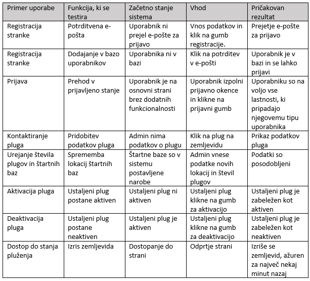
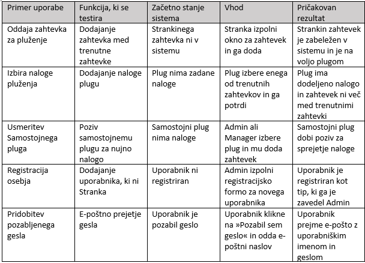

# :blue_square: Končna izdaja (celovito končno poročilo)

| [:arrow_backward:](03_Izvedljiv_sistem_2_porocilo_o_stanju.md) Prejšnji dokument |                       Trenutni dokument                       | Naslednji dokument |
| :------------------------------------------------------------------------------- | :-----------------------------------------------------------: | -----------------: |
| :green_square: **Izvedljiv sistem** (2. poročilo o stanju)                    | :blue_square: **Končna izdaja** (celovito končno poročilo) |                    |

![Terminski načrt](https://teaching.lavbic.net/plantuml/svg/hPVBRjiu58RtV0gYNJWrO3UYxCGT147HTWeKCq2BegiQNPnOj4DB9WMILXiFyWXvY7cNzBrwgCXAP54NTmRn8Zuc__zSFbBsQsD1snL8Q-cpBrnlX3Ine1BkxxHzHiY5iJS9loJvYdS2LXesz1z2gHKRdWZ9ypUK_et_lbM9qlJvahc_FFfUIViGnNqt6BfrEy74nQuti8XNMcrbLEpbi-Lq6HqgJj-_cVtvjjWEMgllTTVAcer8kB6gpEvtV1Q9CZng4l0McOZLjIqhlIKNBulk4UofJC7rxkf0oMgG1Z_YqfB1jOWuNIfbhzGFae1SRM75gKb8geMqPW49fzyvZvCRb0IxrH7SO4DuaImnA5kDi5Cs6PtYAw3270RPUIquzQt487iI98E7S3WAPddO5OAj4f8-ZquvBA_sA_3LiGAbpnfMx1SKMTONa4zQhVd2qfnXGnysi57mYf3vHRxXZt8abryHQMvvJCKkWpN8DT0K1JVS0Zq9NetP-CN5otpJvJTw3MdAfQ5WdweEvcqYXMDkrbFGa-Pm-66NgaIkUORod6QfXf__GY953CEXAtyuJBLQYaHejm1Z9m6rFEBoYHqOEdyNVAC966pCb28L1jF_3V5gLVsCV5LzXbs45uRb6SseYRSf7hkzfTXTeH_sT2SoQ2c8LNmeo6W_UcohIsDWA9THNkWnVdrgxEjDHYCQZ2aQQrW8v6Cqye_v4tAJg1NoWn37DgyxTDvI77g7U-_WeS4rT-RSyq1UkqUwKkB_O5Elw6CKGN4Sq1jASvpcR1osdWLtaM3YZGhL-VHIyvt_bShmmgt9LxlmzG3cMXF2HyeQ9O-LSj2mFj1yD7BhhXyZZEMRDcQcvJ0ddNNuTFi0qz-Z4HSyAgdIwlvE942LsopNMteo6qzQP-mUB8_4-4Kg5VGIR8R6wt003kkOzhGEZbVsM3a7JzW7dW-x33bTYwmOiwDduf_iMJdPMMSnNk5Ay_-pIIC-p8_FsNZQEctthUCH7zQDJo_1PdnO3tp2ZdcVrV5XBVZqbdFuJ0xn6VZu-Kl9-plfdfkkRIrtJy2wdYIb-zmZs-VgES9Yq4XFd3jpTt6NRJnXvvspPkTatY9HoR-VtA2P7O_30JcJZb47hEnsY-ZHOXxUSPHyuVs27GQTRGW3R4EZGXMANchaDQQP_t3z1G00 "Terminski načrt")

Končno poročilo naj bo edini vir za pregled poljubnega vidika projekta. Pričakuje se, da vsebuje posodobljene podatke o dodani vrednosti za naročnika iz [predloga projekta](01_Predlog_projekta.md), opredelitvi problema iz [1. poročila o stanju](02_Osnutek_sistema_1_porocilo_o_stanju.md) in opis sistema iz [2. poročila o stanju](03_Izvedljiv_sistem_2_porocilo_o_stanju.md). Razdelek [**9 Refleksija**](#9-refleksija) predstavlja retrospektiven pogled na celoten pogled. Vsebino iz prejšnjih poročil lahko ponovno uporabite, vključno z uporabniškimi zgodbami, primeri uporabe, kontekstnim diagramom in osrednjimi arhitekturnimi pogledi.

## :page_with_curl: Opisni naslov, osredotočen na prednosti za naročnika

## :information_desk_person: Ime ekipe: Člani ekipe

## 1 Uvod

### Začetni odstavek

- Kaj je projekt?
  - Kakšna je motivacija za ta projekt?
- Kaj je pri tem izvirnega?
  - Še kakšen vidik za orientacijo bralca?

### 1.1 Izzivi

- Na kratko opišite glavne izzive za ekipo.
  - Kako ste jih naslovili?
  - Je bila tehnologija ekipi znana ali nova?

### 1.2 Poudarki

- Izpostavite, kaj ste v okviru projekta dosegli.

### 1.3 Spremembe

- Povzemite vse večje spremembe predloga katerega koli vidika projekta med semestrom.
- Vključite datum, motivacijo, opis in posledice vsake spremembe.

## 2 Potrebe naročnika

- Kdo je primarni naročnik (zunaj ekipe)?
  - Opišite dejanskega naročnika.
- Kdo so sekundarni deležniki?
- Kaj so deležniki želeli? Zakaj?
- Kakšna je njihova želena splošna izkušnja?

### 2.1 Uporabniške zahteve

- Zapišite **SMART** uporabniške zgodbe s pomočjo predloge "Kot **_\<vloga\>_** želim **_\<akcija\>_**, da **_\<posledica\>_**."
- Za uporabniške zgodbe zapišite teste sprejemljivosti z uporabo predloge "Glede **\<pogoj\>**, ko **\<akcija\>**, potem **\<posledica\>**."

## 3 Cilji projekta

Projekt bo samodejno organiziral pluženje po približku optimalnega načrta plužnih poti. Poti bo spremenil ob sprotnem dodajanju in odvemanju plugov, kar naročniku omogoča večjo prilagodljivost. Na ta način bo zmanjšal stroške goriva dela, ter občanom izboljšal izkušnjo s prometom na dni sneženja.
Z delom aplikacije, ki samostojnim plugom omogoča povezovanje s pravnimi in fizičnimi osebami za pluženje parkirišč in dvorišč, bomo izboljšali kaotično stanje, ki nastane ob novozapadlem snegu. Tako bo delo lažje organizirano in razporejeno, saj se ne bo vsako podjetje potrebovalo dogovarjati z določenim opravljalcem plužnih storitev, da to poskrbi za njih. Prav tako lahko pomaga šibkejšim članom družbe, naprimer starejšim, ki svojih dvorišč ne morejo očistiti sami, kar povzroča tudi poledico in nevarnost poškodbe zaradi padca.

### 3.1 Primeri uporabe

##### Slovar pojmov

- UI - uporabniški vmesnik (User Interface). Je grafična podoba in osnovno delovanje spletne strani.
- Baza - podatkovna baza, baza podatkov.
- SCRUM master - vodja delovnega procesa skupine.
- Product owner - oseba, ki zajema uporabniške zahteve in jih komunicira ekipi.
- Samostojni plug - plužilec zunaj osnovnega okvira pluženja (npr. kmetje).
- Ustaljeni plug - običajni plug, ki je del sistema (npr. plug družbe Zelenice).
- API - aplikacijski vmesnik. Zunanja storitev, od katere prejmemo podatke.
- frontend - spletna stran in uporabniška izkušnja aplikacije.
- backend - zaledni sistem, kjer se procesirajo podatki in se izvaja poslovna logika.
- hevristični algoritem - algoritem, ki ne išče popolne rešitve, temveč čim boljšo rešitev na osnovi vmesnih približnih ocen prave smeri izvajanja. Je veliko hitrejši od algoritma, ki bi našel najboljšo rešitev. 
- Vite - okolje za razvoj frontend-a.
- Continuous Deploymentu - posodabljanje aplikacije ob vsaki spremembi kode.
- Python - programski jezik, ki ga uporabljamo za backend.
- JavaScript - programski jezik, ki ga uporabljamo za frontend.
- node.js - razširitev jezika JavaScript.
- GitHubCopilot - kot ChatGPT za programsko kodo.
- programski hrošč - napaka v kodi.
- refactoring - izboljšava preglednosti sicer delujoče kode.

#### 3.1.1 Akterji, katere funkcionalnosti imajo na voljo.

Poznamo 6 vrst akterjev.
Neregistriran uporabnik je vsakdo, ki obišče osnovno spletno stran. Vidi lahko zemljevid stanja spluženosti cest in ima možnost registracije, da postane Stranka.
Admin je glavni upravitelj s sistemom. Njegova glavna naloga je upravljanje s štartnimi bazami pluženja in dodajanje novih akterjev (razen teh tipa Stranka).
Ustaljeni plug predstavlja plug znotraj obstoječega sistema pluženja, Samostojni plug pa je neodvisen delavec, ki pomaga pri pluženju, kot so pogosto kmetje, ki jim je pluženje dodatna dejavnost.
Stranka je lahko vsakdo, ki želi oddati zahtevek za pluženje neke površine na področju MOC. To so lahko fizične ali pravne osebe.
Manager pluženja opravlja koordinacijo plugov pri napotitvah na zahtevke za pluženje.

Akterjem je na voljo 12. funkcionalnosti, ki v ozadju uporabljajo še 8 podpornih funkcionalnosti. Določenemu tipu akterja je dostopen določen nabor funkcionalnosti. Ta nabor je predstavljen s terko številk.Oštevilčenost funkcionalnosti je na voljo spodaj.

Neregistriran uporabnik: (1, 2)
Admin: (1, 3, 4, 5, 10, 11, 12)
Ustaljeni plug (3, 6, 7, 9, 12)
Stranka (1, 3, 8, 12)
Samostojni plug (3, 9, 12)
Manager pluženja (1, 3, 4, 10, 12)

Uporabniške funkcionalnosti:
1. Dostop do stanja pluženja 
2. Registracija Stranke
3. Prijava
4. Kontaktiranje pluga
5. Urejanje števila plugov in štartnih baz
6. Aktivacija pluga
7. Deaktivacija pluga
8. Oddaja zahtevka za pluženje
9. Izbira naloge pluženja
10. Usmeritev Samostojnega pluga
11. Registracija osebja
12. Pridobitev pozabljenega gesla

Podporne funkcionalnosti:
13. Poskus registracije
14. Potrditev registracije
15. Posodobitev štartnih baz
16. Potrditev (de)aktivacije
17. Dodajanje zahtevka
18. Izbira zahtevka
19. Dodajanje uporabnika

#### 3.1.2 Primeri uporabe

Business value ocenjujemo na skali od 1 do 10, kjer 1 pomeni “zelo majhna poslovna vrednost” in 10 pomeni “ogromna poslovna vrednost”.
Pogostost uporabe ocenjujemo na skali od 1 do 10, kjer 1 pomeni “skoraj nikoli uporabljeno” in 10 pomeni “uporabljeno ves čas”.

##### 1. Dostop do stanja pluženja (MUST HAVE)
Dostop do stanja pluženja uporabniku izriše zemljevid pluženja, kjer so cest pobarvane glede na zasneženost oziroma čas od zadnjega pluženja, ter so vidne trenutne lokacije plugov.
Business value: 8
Pogostost uporabe: 10

Osnovni tok:
1. Uporabnik dostopa do začetne spletne strani sistema.
2. Zaslonska maska kliče GoogleMaps API in pridobi zemljevid območja.
3. Zaslonska maska od zalednega sistema pridobi stanje cest.
4. Kot del strani se izriše zemljevid stanja pluženja.

##### 2. Registracija Stranke (SHOULD HAVE)
Neregistriran uporabnik se lahko registrira v sistem in tako postane Stranka.
Business value: 6
Pogostost uporabe: 2

Osnovni tok:
1. Uporabnik dostopa do začetne spletne strani sistema.
2. Uporabnik klikne na gumb “Registracija”.
2. Izriše se registracijsko okno.
3. Uporabnik vnese svoje podatke (e-poštni naslov, uporabniško ime, geslo), pri čemer geslo vnese dvakrat, ter klikne na gumb “Registriraj me”.
4. Sproži se tok dogodkov primera uporabe “Poskus registracije”.
5. Primer uporabe “Poskus registracije” vrne sporočilo o uspešnosti.
6. Uporabnik je preusmerjen na začetno spletno stran sistema.
7. Sproži se tok dogodkov primera uporabe “Potrditev registracije”

Predpogoj: Uporabnik še ni registriran v sistem kot Stranka.
Popogoj: Uporabnik prejme e-poštno sporočilo, kjer lahko potrdi prijavo.

Alternativni tok:
Če na koraku 5 “Poskus registracije” vrne sporočilo, da registracija ni uspešna, uporabnika obvesti o napaki. (Primer: “Uporabnik s tem e-poštnim naslovom že obstaja). Tok se zaključi.

##### 3. Prijava (MUST HAVE)
Prijava obstoječim uporabnikom omogoči vstop v sistem in dostop do funkcionalnosti, ki so namenjene njihovemu tipu uporabnika.
Business value: 10
Pogostost uporabe: 8

Osnovni tok:
1. Uporabnik dostopa do začetne spletne strani sistema.
2. Kot del strani se izriše prijavno okno.
3. Uporabnik vnese prijavne podatke ter klikne na gumb “Prijava”.
4. Zalednemu sistemu je poslan zahtevek za prijavo.
5. Zaledni sistem vrne sporočilo o sprejetju prijave.
6. Uporabnik je preusmerjen na spletno stran, ki je primerna njegovemu tipu uporabnika.

Predpogoj: Uporabnik je potrjeno registriran.
Popogoj: Uporabnik lahko uporablja funkcionalnosti, ki so na voljo njegovemu tipu uporabnika.

Alternativni tok:
Če je koraku 5 vrnjeno sporočilo o zavrnitvi prijave, se o tem izpiše obvestilo. (Primer: “V podanem uporabniškem imenu ali geslu je prisotna napaka.”) Tok se zaključi.

##### 4. Kontaktiranje pluga (COULD HAVE)
Admin in Manager preko uporabe Kontaktiranje pluga pridobita kontaktne podatke izbranega pluga.
Business value: 2
Pogostost uporabe: 2

Osnovni tok:
1. Admin/Manager na strani Admin UI/Manager UI klikne na enega od plugov na zemljevidu ali enega od plugov v tabeli deaktiviranih plugov.
2. Odpre se okno s kontaktnimi podatki izbranega pluga.

Predpogoji:
Uporabnik je prijavljen kot Admin ali Manager.

##### 5. Urejanje števila plugov in štartnih baz (COULD HAVE)
Primer uporabe omogoča Admin-u, da spremeni lokacije štartnih baz in število plugov, ki posamezni bazi pripadajo. Tako vpliva na algoritem izbire najboljših poti.
Business value: 4
Pogostost uporabe: 2

Osnovni tok:
1. Admin na strani Admin UI klikne na gumb “Uredi štartne baze”.
2. Izriše se okno s tabelo štartnih baz, njihovih lokacij ter njihovo številčnostjo pripadajočih plugov.
3. Admin v oknu ureja podatke in klikne na gumb “Shrani”.
4. Izrisano okno s tabelo štartnih baz se zapre. 
5. Sproži se tok dogodkov primera uporabe “Posodobitev štartnih baz”.
6. Primer uporabe “Posodobitev štartnih baz” vrne sporočilo o uspešnosti, ki se uporabniku izpiše.

Predpogoj: Uporabnik je prijavljen kot Admin.
Popogoj: Podatki štartnih baz so posodobljeni.

##### 6. Aktivacija pluga (SHOULD HAVE)
Ustaljeni plug preko Aktivacija pluga svoj plug vrne v med aktivne pluge v stanju pluženja, če je bil predhodno deaktiviran.
Business value: 4
Pogostost uporabe: 3

Osnovni tok:
1. Ustaljeni plug na Plug UI klikne na gumb “Aktivacija”.
2. Sproži se tok dogodkov primera uporabe “Potrditev (de)aktivacije”.
3. Primer uporabe “Potrditev (de)aktivacije” vrne sporočilo o uspešnosti, ki se uporabniku izpiše.
4. Gumb “Aktivacija” se spremeni v gumb “Deaktivacija”

Predpogoji:
Uporabnik je prijavljen kot Ustaljeni plug.
Ustaljeni plug je deaktiviran.

Popogoj: Ustaljeni plug je dodan na seznam aktivnih plugov.

Alternativni tok:
Če na koraku 3 “Potrditev (de)aktivacije” vrne sporočilo, da aktivacija ni uspešna, se o tem izpiše obvestilo. Tok se zaključi.

##### 7. Deaktivacija pluga (SHOULD HAVE)
Ustaljeni plug izvzame svoj plug vrne iz stanja pluženja.
Business value: 4
Pogostost uporabe: 2

Osnovni tok:
1. Ustaljeni plug na Plug UI klikne na gumb “Deaktivacija”.
2. Sproži se tok dogodkov primera uporabe “Potrditev (de)aktivacije”.
3. Primer uporabe “Potrditev (de)aktivacije” vrne sporočilo o uspešnosti, ki se uporabniku izpiše.
4. Gumb “Deaktivacija” se spremeni v gumb “Aktivacija”

Predpogoji:
Uporabnik je prijavljen kot Ustaljeni plug.
Ustaljeni plug je aktiviran.

Popogoj: Ustaljeni plug je odstranjen iz seznama aktivnih plugov.

Alternativni tok:
Če na koraku 3 “Potrditev (de)aktivacije” vrne sporočilo, da deaktivacija ni uspešna, se o tem izpiše obvestilo. Tok se zaključi.

##### 8. Oddaja zahtevka za pluženje (SHOULD HAVE)
Primer uporabe omogoči Stranki, da je njihov zahtevek dodan v bazo trenutnih zahtevkov.
Business value: 6
Pogostost uporabe: 5

Osnovni tok:
1. Stranka na Stranka UI v okno zahtevka vnese podatke zahtevka ter klikne na gumb “Oddaj zahtevek”.
2. Sproži se tok dogodkov primera uporabe “Dodajanje zahtevka”.
3. Primer uporabe “Dodajanje zahtevka” vrne sporočilo o uspešnosti, ki se uporabniku izpiše.

Predpogoj: Uporabnik je prijavljen kot Stranka.
Popogoj: Zahtevek je dodan med trenutne zahtevke.

##### 9. Izbira naloge pluženja (SHOULD HAVE)

Samostojni plug ali Ustaljeni plug prevzame opravljanje zahtevka pluženja, ki je odstranjen iz baze trenutnih zahtevkov.
Business value: 6
Pogostost uporabe: 3

Osnovni tok:
1. Samostojni plug ali Ustaljeni plug klikne na gumb “Izberi nalogo”.
2. Odpre se okno z nalogami, ki so na voljo, in so uporabniku blizu po geolokaciji.
3. Uporabnik označi nalogo in klikne na gumb “Izberi”.
4. Okno z nalogami se zapre.
5. Sproži se tok dogodkov primera uporabe “Izbira zahtevka”.
6. Primer uporabe “Izbira zahtevka” vrne sporočilo o uspešnosti, ki se uporabniku izpiše.

Predpogoj: Uporabnik je prijavljen kot Samostojni plug ali Ustaljeni plug.

Popogoj: Zahtevek je odstranjen iz trenutnih zahtevkov.

##### 10. Usmeritev Samostojnega pluga (COULD HAVE)
Admin ali Manager lahko napotita Samostojni plug na nalogo iz množice trenutnih zahtevkov, če opazita, da je ta res nujna.
Business value: 1
Pogostost uporabe: 2

Osnovni tok:
1. Uporabnik klikne na plug na izrisanem zemljevidu.
2. Poleg kontaktnih podatkov se pojavi gumb “Usmeri”, ki ga klikne.
3. Izbranemu plugu je na njegov UI dodano rdeče obvestilo o usmeritvi z gumbom “Sprejmi”. Klikne ga takoj, ko lahko.
4. Sproži se tok dogodkov primera uporabe “Izbira zahtevka”.
5. Primer uporabe “Izbira zahtevka” vrne sporočilo o uspešnosti, ki se izbranemu plugu izpiše.
6. Izbranemu plugu se iz UI odstrani rdeče obvestilo.

Predpogoj: Uporabnik je prijavljen kot Admin ali Manager in izbrani plug je prijavljen kot Samostojni plug ali Ustaljeni plug.

Popogoj: Zahtevek je odstranjen iz trenutnih zahtevkov.

##### 11. Registracija osebja (MUST HAVE)
Admin lahko v sistem doda kateregakoli od akterjev.
Business value: 10
Pogostost uporabe: 2

Osnovni tok:
1. Admin klikne na gumb “Dodaj uporabnika”.
2. Izriše se okno v katerem lahko izbere tip uporabnika in vnese njegove podatke. Klikne na gumb “Dodaj”.
3. Sproži se tok dogodkov primera uporabe “Dodajanje uporabnika”.
4. Primer uporabe “Dodajanje uporabnika” vrne sporočilo o uspešnosti, ki se izpiše.

Predpogoj: Uporabnik je prijavljen kot Admin.
Popogoj: Uporabniški profil je dodan v sistem.

Alternativni tok:
Če na koraku 3 “Dodajanje uporabnika” vrne sporočilo, da dodajanje ni uspešno, se le-to izpiše.

##### 12. Pridobitev pozabljenega gesla (MUST HAVE)
Če uporabnik pozabi geslo ga lahko pridobi preko e-pošte.
Business value: 10
Pogostost uporabe: 4

Osnovni tok:
1. Uporabnik klikne na gumb “Pozabil sem geslo”.
2. Izriše se okno za vnos e-poštnega naslova. Uporabnik klikne na gumb “Potrdi”.
3. Sproži se tok dogodkov primera uporabe “Pozabljeno geslo”.
4. Primer uporabe “Pozabljeno geslo” vrne sporočilo o uspešnosti, ki se izpiše.

Predpogoj: Uporabnik je predhodno že bil dodan v bazo uporabnikov.
Popogoj: Uporabnik je prejel e-pošto z geslom.

 Podporne funkcionalnosti:

##### 13. Poskus registracije (SHOULD HAVE)
Poskus registracije uporabnika pripravi, da lahko potrdi svojo registracijo.
Business value: 6
Pogostost uporabe: 2

Osnovni tok:
1. Dobimo zahtevek za registracijo s podatki o uporabniku.
2. Preverimo, če uporabnik s tem e-poštnim naslovom že obstaja.
3. Dodamo ga v bazo še nepotrjenih uporabnikov.
4. Vrnemo sporočilo o uspešnem vpisu.

Popogoj: Uporabnik je vpisan v bazo nepotrjenih uporabnikov.

Alternativni tok:
Če v koraku 2 ugotovimo, da je uporabnik že v naši bazi, vrnemo sporočilo o neuspelem vpisu.

##### 14. Potrditev registracije (SHOULD HAVE)
Potrditev registracije zaključi registracijo uporabnika po tem, ko jo je potrdil na prejetem e-poštnem sporočilu.
Business value: 6
Pogostost uporabe: 2

Osnovni tok:
1. Zaledni sistem pošlje e-poštni naslov uporabnika.
2. Preverimo, če je uporabnik s takšnim e-pošnim naslovom prisoten v bazi nepotrjenih uporabnikov, ter pridobimo njegove ostale podatke.
3. Sproži se tok dogodkov primera uporabe “Dodajanje uporabnika”.
4. Primer uporabe “Dodajanje uporabnika” vrne sporočilo o uspešnosti.
5. Uporabnika odstranimo iz baze še nepotrjenih uporabnikov.
6. O uspešni prijavi ga obvestimo na e-poštni naslov.

Predpogoji:
Uporabnik je vpisan v bazo nepotrjenih uporabnikov.
Uporabnik še ni vpisan v bazo uporabnikov.

Popogoj: Uporabnik je vpisan v bazo uporabnikov.

Alternativni tokovi:
Če v koraku 2 ugotovimo, da uporabnik še ni v naši bazi uporabnikov, ga na e-poštni naslov opozorimo o nenavadnem delovanju. Tok se ustavi.
Če v koraku 4 dobimo sporočilo o neuspešnem dodajanju, uporabniku na e-pošto posredujemo vzrok napake. Tok je zaključen.

##### 15. Posodobitev štartnih baz (COULD HAVE)
V zaledju se spremenijo podatki o štartnih bazah.
Business value: 4
Pogostost uporabe: 2

Osnovni tok:
1. Dobimo podatke o željeni spremembi podatkov o štartnih bazah.
2. V bazi spremenimo podatke.
3. Vrnemo sporočilo o uspešnosti.

Popogoj: Podatki o štartnih bazah so posodobljeni.

Alternativni tokovi:
Če je sprememba podatkov v koraku 2 neuspešna, vrnemo sporočilo o neupešni spremembi.

##### 16. Potrditev (de)aktivacije (SHOULD HAVE)
Sprememba stanja aktivnosti pluga.
Business value: 4
Pogostost uporabe: 5

Osnovni tok:
1. Dobimo zahtevek za spremembo, ki vsebuje šifro pluga in željeno stanje (aktiviran/deaktiviran).
2. Preverimo trenutno stanje pluga.
3. Spremenimo stanje pluga.
4. Vrnemo sporočilo o uspešni spremembi.

Predpogoj: Plug je že zaveden v bazi.
Popogoj: Stanje pluga je enako kot v zahtevku.

Alternativni tokovi:
Če v koraku 2 ugotovimo, da je trenutno stanje že enako željenemu stanju, vrnemo sporočilo o uspehu, ter sporočilu dodamo, da se stanje ni spremenilo.
Če v koraku 2 ugotovimo, da plug ni zaveden v bazi, vrnemo sporočilo o neuspehu ter povemo, da pluga ni v bazi.
Če v koraku 3 ne uspemo spremeniti stanja pluga, vrnemo sporočilo o neupehu, kjer dodamo, da je prišlo do neznane napake in naj uporabnik poskusi kasneje.

##### 17. Dodajanje zahtevka (SHOULD HAVE)
Zahtevek za pluženje je dodan med trenutne zahtevke.
Business value: 6
Pogostost uporabe: 5

Osnovni tok:
1. Dobimo podatke zahtevka.
2. Preverimo, da uporabnik, ki je zaveden na zahtevku, res obstaja.
3. Zahtevek dodamo na seznam trenutnih zahtevkov.
4. Vrnemo sporočilo o uspehu.

Predpogoj: Uporabnik v podatkih zahtevka je vpisan v bazo Strank.
Popogoj: Zahtevek je dodan med trenutne zahtevke.

Alternativni tokovi:
Če v koraku 2 ugotovimo, da uporabnik še ni v naši bazi Strank, ali v koraku 3 ne moremo dodati zahtevka na seznam trenutnih zahtevkov, vrnemo sporočilo o neuspetju. Tok se ustavi.

##### 18. Izbira zahtevka (SHOULD HAVE)
Plug je izbral zahtevek, zato zahtevek ne bo več na voljo.
Business value: 6
Pogostost uporabe: 3

Osnovni tok:
1. Dobimo identifikator zahtevka in podatke o plugu.
2. Preverimo, da je zahtevek na seznamu trenutnih zahtevkov in da plug res obstaja.
3. Z namenom deaktivacije se sproži tok dogodkov primera uporabe “Potrditev (de)aktivacije”.
4. Primer uporabe “Potrditev (de)aktivacije” vrne sporočilo o uspešnosti.
5. Preverimo, da je zahtevek še vedno na seznamu trenutnih zahtevkov.
6. Zahtevek odstranimo iz trenutnih zahtevkov.
7. Zahtevek dodelimo plugu.
8. Vrnemo sporočilo o uspešnosti.

Predpogoji:
Zahtevek je na seznamu trenutnih zahtevkov.
Plug je v bazi plugov.

Popogoji:
Zahtevek ni več med trenutnimi zahtevki.
Plug je deaktiviran.

Alternativni tokovi:
Če v koraku 2 odkrijemo napako, vrnemo sporočilo o neuspešnosti z navedenim razlogom.
Če v koraku 3 dobimo sporočilo o neuspešnosti, vrnemo sporočilo o neuspešnosti z navedenim razlogom.
Če v koraku 5 ugotovimo, da zahtevek ni več na voljo, vrnemo sporočilo o neuspešnosti in opozorimo plug, da je morda bil deaktiviran kljub neuspetju pridobitve zahtevka.

##### 19. Dodajanje uporabnika (MUST HAVE)
Admin lahko dodaja vse vrste uporabnikov.
Business value: 10
Pogostost uporabe: 2

Osnovni tok:
1. Dobimo zahtevek za dodajanje uporabnika.
2. Uporabnika dodamo v bazo.
3. Vrnemo sporočilo o uspešnosti.

Popogoj: Novi uporabnik je prisoten v bazi uporabnikov.

Alternativni tokovi:
Če v koraku 2 ugotovimo, da je uporabnik že prisoten, uspešnemu sporočil dodamo obvestilo, da je uporabnik že predhodno obstajal.

##### 20. Pozabljeno geslo (MUST HAVE)
Pošiljanje pozabljenega gesla na e-pošto uporabnika.
Business value: 10
Pogostost uporabe: 4

Osnovni tok:
1. Dobimo zahtevek o pozabljenem geslu z e-pošto uporabnika.
2. Dobimo geslo iz baze uporabnikov.
3. Pošljemo geslo in uporabniško ime na e-poštni naslov.
4. Vrnemo sporočilo o uspešnosti.

Popogoj: Uporabnik s takšno e-pošto obstaja v bazi uporabnikov.

Alternativni tokovi:
Če v koraku 2 ugotovimo, da takšnega uporabnika ni, prekinemo tok.

#### 3.1.3 Sprejemni testi

### 3.1.4 Diagram primerov uporabe

#### 3.1.5 Nefunkcionalne zahteve

Sistem mora delovati za simultano organizacijo do 100 plugov.
Plug pa je avtomatsko voden v smeri njemu začrtanega pluženja. Posodabljanje informacij se dogaja v realnem času, torej se za potrebe pluženja mora posodobiti v največ eni minuti od zadnje spremembe stanja plugov na cestah in sprememb informacij o štartnih bazah.
Zemljevid stanja na cestah je na voljo tudi neregistriranim uporabnikom in prikazuje stanje za največ 5 minut nazaj.
V okviru organizacije opravljanja zahtevkov za pluženje moramo v primeru MOC omogočati hranjenje vsaj 30.000 zahtevkov naenkrat.
Omogočati moramo registriranost za vsaj 70.000 strank, ter hkratno prijavljenost za vsaj 5000 strank.

### 3.2 Merila uspeha

- Kako veste, ali je naročnik dobil želene koristi?
- Katera merila uspeha so pomembna naročniku?

## 4 Opis sistema

### 4.1 Pregled sistema

- Predstavite sistem in glavne izzive.
  - Povzemite utemeljitve izbranih načrtovalskih odločitev.
  - Narišite kontekstni diagram, ki prikazuje, kako sistem sodeluje z zunanjimi storitvami, podatkovnimi bazami ipd. Jasno označite meje sistema.
  

- Na kratko pojasnite zunanje interakcije sistema.

### 4.2 Osrednji arhitekturni pogledi

- Za vsak pogled zagotovite osrednji diagram.
- Za arhitekturne elemente v diagramu dodajte katalog elementov z imenom in namenom vsakega elementa.
- Za vsak element določite enega člana ekipe (tudi, če je več članov ekipe prispevalo k elementu), ki bo njen skrbnik.

    - #### **Komponenti diagram**
  

  - #### **Deployment diagram**
  

 - #### **Diagram zaporedja**
 

- #### **Diagram aktivnosti**
  

ZA POPRAVIT
- #### **Razredni diagram**
  

## 5 Končno stanje

- Kaj deluje? Vključite posnetke zaslona.
- Katere teste ste izvedli?
- Ocenite ustreznost testov.
- Koliko vrstic kode ste napisali (vse skupaj)?

## 6 Vodenje projekta

- Opišite uporabljen razvojni proces.
- Kateri so bili ključni dogodki med projektom? Vključite tudi datume.
- Še kaj drugega?

### 6.1 Usklajevanje ekipe

- Kdaj in kako pogosto se je ekipa sestajala?
- Kako ste komunicirali?
- Kaj ste dosegli med sestanki?

### 6.2 Projektni načrt

**SEZNAM IZDELKOV**

1. iteracija (21 dni)
- Pregledani podatki in začetna vizualizacija (1 dni)
- Zapisnik snovanja idej pristopa k algoritmu (2 dni)
- Zapisnik pregled obstoječih rešitev (2 dni)
- Definiranje uporabniških zgodb in funkcionalnih zahtev (2 dni)
- Predloga projekta (4 dni)
2. iteracija (21 dni)
- Izvedba okrnjenega algoritma planiranja s pomočjo PyVRP (10 dni)
- Izdelava simulacije naključnega nabora voženj po mestu - kot merilo uspešnosti algoritma pluženja (8 dni)
- Obdelane .shp datotek kot predpriprava za izvajanje algoritma (1 dni)
- Home page UI: vsebuje zemljevid stanja cest, login (2 dni)
- Avtentikacija Admin-a in Ustaljenih Plugov (1 dni)
- Admin UI - lokacije plugov, št plogov v bazah... (8 dni)
- Ustaljeni Plug GPS sharing - vsi aktivni Ustaljeni plugi delijo svojo lokacijo z Adminom. (3 dni)
- Ustaljeni Plug UI - glede na trenuten GPS se mu izpisujejo navodila za nadaljno pot, možnost deaktivacije/pavze (3 dni)
- Testi enot. (2 dni)
3. iteracija (28 dni)
- Vključitev kmetov v pluženje z VOC in Zelenice (4 dni)
- Razvoj svojega algoritma organizacije pluženja (14 dni)
- Ročno testiranje sistema kot celote (4 dni)
- Izdelava dokumentacije sistema kot celote (2 dni)
4. iteracija (28 dni)
- Načrtovanje poti neregirstrianim uporabnikom (8 dni)
- Nadaljnji razvoj algoritma organizacije pluženja.
- Posodobitev pomembnosti posameznih cest glede na njihovo priljubljenost. (1 dni)
- Ročni testi za testiranje sistema kot celote. (4 dni)
- Integracijsko testiranje tretje iteracije s prejšnjima (4 dni)
- Vsi testi enot. (4 dni)
- Celotna dokumentacija kode s popravki (2 dni)

![Ganttov diagram](https://teaching.lavbic.net/plantuml/png/dLdTRgD65BxtKupQYswZhhjnicfQLLLPcpXi7MFX7tMtggoncTXZOCQ2WJQk-WXvY7sHNYNlrJC3XW4JuqI950UO-Rxpyvrp6FyQ2HoA5MP2eA_wyWzFa4lnAiJ1LwtMpv6uzyalBVL0BxsC_caX96X0VCg8-WUX0NpiSf-7wEkxZlnHLwyv4-bLM7SFb_wLAt7aPQi-uAMt2ddCt6mjkRfxV-TMTtn__U7Ax6RBuHU78V_h4BZqM41z4WcU4tmDrDBd4N6Vsw3MJf-krY8tzj_Mpzzd3cn57cLRBDstgEmaGimYk4MOQAsfIz0TvsB1_sxvcArYl28eybkjRSWtP2cGYbU4n9gWyn_56l4xT4qMOOp3UzHvrxbiHLZ4eOll8_0JoMneHO1MkTJwu-ni519t6z9jY1DoTeRU_81SHh_z4-48_J5opDwVoCSHeC5rMAsMdBSH5IJ4Ixh1PsTlEkVQ4cjYEkVxDHVeBq8yW6JkdZGMsRRVH8Z0PRcVjLlG42Ewsz44_Z34iBp0DWI1BpQILGdYymVBCVOOvoYrwbc8pCYL3t7SSXSB3z8RG7RuyO48Xb52Tp7swIwpfmm66_K7XHVgqJ961TwOyIJdZy2za8TRZ3o4_HKFgGXYYTFHSCP3UsOCFvfxeCvpPYasXvRn1K1ioEC3NQEGF7s102LLZ6prt377vl3ZIv7682RCF8fSSaUPYWz6J_yHVqD0OYbccaAw_yRcU68CVxCQmwKpAq1xEHP1yPQ7UC7eqnSFZDojkBkGSRoBcRUad66VoSjuNMDvpxosXX2YHWVdT3KFWmOp1Wn7u6iLrop_oO6F1yP9G3gZmsYwt8i3A0Rr49cpUdRtDHZMpYK-1g5jGVa-NyaFa3cUKBb_MH9QpnmOirngbqTZ9-deA0bn5nZoGeGysiBsDAcuJKyJnvmuTYb73ZMMaIam7B8ZOS8W8p4xsD3wV7Ix533RIsxMAHKrT5ZLEWrLBQryfRAMke1x8PCQ0K_lvGy-tsSLHX6KfO0_Fcmu6jtFd94ovPqUy4zmDRVcNNq9qj0b-EUqkb4Kubt2DsfnXG8FeQMdPOy0dnYqBEb0HOGowUCLHMkIoD95lMeATgVZYNqxDmPzsx4cDxSDjKJnrtoTfs14WzXF2J3i-PluyK6HX0O0MaS9Lvo03mgW-iJeBVAuWCyXzJcA8QsUlZ0E14kEpGoHdA_qIcJTJWV6nBA7UxPN9tdINcHasz5w2oi45yHJFBP5wyHGUA219NYZ2aLEvw0Stepc89XHGp-fKBZX0KH8ZW5JwoUKH6GH0yYE151x4wgMoiWjmKVV8P0qPTM0tTYtvdnaz1kgKXNOI0HK8UefLI333IXxgphq51R9mWyLT-J7AvvK3JMcanjpEB6w9O_NcrkGqv0b5fWB-xu5axmyIm7hE_Jq1RmFXa8dJs2OWgBVRhVBuJPwjzPmFhME5wyApG8_Dr3PX_gZCOhMEAHi1NoI239ELZIuNJmeoSdkw5DGSWIYutlY7ErIv_6WBHrreV64dUVZ6yEnXlsYmDHItHlqBCcf1Tna_v1gWfcIi1Z2bt8dA8WXGRSqWjG1GWmdtAM-obk6NTY6ST0Pv4y0efEY0akKZShptszniYDLxgF1jA-v-6JU4qZKhAKInaMxcgtJeJMPJw0L7y_MWogapGrP0yrGFEwITZL5ktRFr9jeVN8MN4fjEWv9AdLedlADAF9I5FGc97TuARXCbMyFB7FCQwCxiVLelzYsve6at3rW8faFpTydn-tKcRseZLUx-0bO1IMjALnK6_1LfG5V559-jW5tDEwpjA78IHXv0H6gMEpR0vHFDBExifPz9Zv8Q4cguy-ruToQplXu0Qc2EccxbV8_fTkgQ5tMTzRSXvSlpH07fWcGioXa5a4R9y12jgqbyQ65LQqTVnfFpDkIwXfnwwRAqkZw36xd4BTncDNvlKWBvtLQcFTcvl4SrNWroG4ghTWq3RSATjOvKHYAdoQEooPnN5R5KPUe5vefGnWGGv6zfaBXfuWHUFkWOIH22auDylSjZmVLMKfhMlFf45u0caUgChPgE9jyEcsIYQoZcIYd3dHiPzupPxahVtX9ml28ktoXYWACtIHOf0FabaSu83ivqCWngcYZm7BD4ovVug6SB6IxXGK7pSInZTvyP8zWn0GrVZeUPjq8BSYdoBPzHBTpUsOwnc1mNBzLfbfsCq5MAiSYhqIZck3obGNw7mpV6neSlZOE9sRVKGFL2UNaUJfrKy9btPGmltWjHCsOSF2gaqq91KZd-9mmlpXnKZXzL7WTjbr8gNZ7Lp3lIwS9zaUp2xdZQ32D8q89w8GXuQAs7BuAKBLsy9zqwKWxkL3wW57uyG57kRaPvCpkQTtqX4F9_HaZZT2I-nnYwCfHmI5WS7uaM7UpECSxiZG_WQlT8JyngxjREicgXT0Ee8vHK0stxe7YrAVkRdPGKtjB7hdKGgRd5tMt3WyI6fvwncVwy5BtGAbjr9Alrky6cABMrdkffDtwE9HqL_U8ojhAZO7yTg4V4i9QlqAggYzb_WS0 "Ganttov diagram")

*Ganttov diagram*

![PERT diagram12](https://teaching.lavbic.net/plantuml/png/jLZRSjiu4dtdLtHD7cQtod4iIhuaut8LOz4sDxQaeYHlZMkgL908oH0fGilRxcWodv2Fo8_CK_9Vsm0l8aZAaJAL5qewe823HgFxT8SkyzSa82kOafcx27ZiEzVSum540V537A9-f7bq7a748M2BvmWS5j1PnBYlQU6CU1HEZYyqxJACVlVebHP69A9THXPYqZyq0184_B_o6y0zysaw_TJ3zH3xK_jJktoJ_LSB2pf3COtyr_iAiLVqOduwTyG83nmQPEZfpViBynfdAqtYq3c9lMX4_nSP7bluAzmCpF110-tdqcjh1lg9bbA7dovdOiPtjm6b_jKWI0WGDsA9pyFeyeqSk_e9I0W3s-mER6jW6uy6l9hFwHaz-yN37RvpIE06r85tS9dXHzddrKSuXuzm0lBpD_-ZiCh95gbmUE_5zAfr30mPanbR4eM0DJBjbhgo-4FpidehNG7q2sNX76hSlRMPie00ssmOce7vu1C1-4iApA5BbStJUyisykD9wSXP99yKFSe-aKzEfyvc5vb1G1SUMdND7HAvF15yDkJB9nhv11AsYOd7DdKhuJ7TtflTWuWX1NYh4CkGHc93doU5JM0Ti33YQm8k46_10nQjOeNGiDT_D7h_ClTcfAThGwkbKCgX5ut5fqXcIRzyOiyGqA-VqPEI9lDC1lskCVhGV_oXh8OKKTzbucOoNteIWQz_KMz9VPhnIwXgBNCuCdeVh8FEhoKVkaAim1gPTGj25E8r3yZKPry_ksYrpO8xK-5hyzXtPnZsYESBc3nNJTarRwmUte53pxOb7nsLROurdwv7Sh8-2V6SfVTbGKArt-3U-2vE7V4uKpdbs8iUvt0t5e6sWKhcQjt-zG_cOcqSwX4CMMiCmnvVY2zu2zoe4a2VkkQzZDvxiiaNnNIXiicnflXjRHBgJ0cwTnJmS4r5CjbrMhOvill3WVbXP3qQ4skqTtXlPGHad2ynAx0cPZRTq23nyJeIlqBZoRIhMUqRYyk7UkKAh6bn_QMqfX-KriGIq6chQ-TOPUrhlDjUSIRS3NmHUz13yc2DlfBVBW8XPfiL__9foM7m-wCzKFtvLqHKedBs7KOgMBNrEjEsleFfKvhX60Haa_0bU2ICAdnvi432ClLH91zZG1NSCIjYglJ8Wi4pJKHMOgx2_tey7FKV9iRzRTyQtJsWk-bxxoRd36qrRXNOo_SoPAlOImdxnFMMyPTFSbEeBt1DIBZS0_A75QQC6Ce9mNeOtniZgz_R-zfU55O-QR3yoGwo_Mb6zZXyNkCLYNX4NN1v9ACAflbr84OtGXybP2cZSN4eQWwx6qnkh7jpEC4GE3WeaqcAUeDhw-qTjE_u2hs0B2YChNUGX7GQ8x4DNM6IJPW38WEZTypGhaU0iP6fL_-k_s1E1iRjOUaYfTHfeBdB5OmamYJ1N7d_mN1Mp7yj9UOOtnPw07Fim8iNNCsnndXqP_P6rlLX7j3Ag81-gdBCiMQEWXMQ4LwZeTpYVY6d8_Zw6Vq0pOSwDC7Y2UN0yV6nIhNxOFKcO-kWx2AuWAvgpm9h95dOIveBRWT329z9mFm5qav2bbKlR6jOkGUXmJo6SIt4gCBp_N7Of6V1L-fcSDh9yCwmhTxjtljfPxHh0UzjSy1ht8-qlayIxZ1FNhOrNa0XD4Jam2gL-d7aI_x7Hx32k27gDDoRtBKyiZThacogecXyUyZ9VDzEHdZ5CfL6VQuMZ-EUDPgCKDl2gsbxFf-sgnnIz2Zxp2EkS96sgeGAhCB1-4zCjW5tjogxxdTD8Sd63tYlvAtA4m5fdsM9GCoLvG417icvqribLeQsMimMs2wX60SqZPSeoqIZ87Gf1bOyqdy4MBBF8YxSzv_75KroOroF-ga7_Y2RVPUwHdErzmz49vbfe5EnMOvLADdK-LiAifBIxLrjYLQsF7JKYhp0cZHS-oKDrzvRmrraIy2vUam5rdXCZwbk41Kjk2iQoKYSon_CUF28TGR6xoVgOJIPgMQwCUm7qnuU59ibdLEzJl5qbtYpKyqcGkm-acsNEbDPRbLPtRiw6HiuKorPO8sMj57XOWoDjl4gHBL8aQTGEpFgeV9H1Sslmv7vS5ZywcGCu5mLOGMsV_pQavwiC_SCO-Uo-wJMJWNMvFgTbro_Sv3hYoNWhPhp2-p5MhlKgQ0lXFZnqBHJQ-nvLgsSmRbUPtMkVuCLHdAU7r4zrTZcesN-UsygxMBPJWELpZVS1gz_MQXpno52yb1KE2GGMSSdgE6g7IVKROQD8dXWslixaF3lSrLT5fYcAStYrw-lqkQjbhPmvM_PFjMoBgf0idQ9bZSm1PRt3XMmsiBJQZqz-TUiaQOL_KSLpVji0YrrihHoLqkkLZIKwaFR1ezMRlQa-qjxBLhHT15ehTzHiaZMXD1A7QpSSBgMDWdaeg8AroebbXXeA6-RNjlMawL9rVTA0qLvLCBKcaIhb2ZoZQmKq8gQGA0bJQqEPF9KIniCk_RILBwBTmjfgPLAvSf0tGpRmMq5gE8D-zeEbki3TIJNsYgwrR_fKHVQJYlhlDpVXCIg3TIKJksDPcch5Q8jTwUsbkeLyJiJ1YMaPESIMag1vPEeZPLJPMbCN95IcigPTBGqVKXZPL6x19K2Q0bL0fPM3hBrqI8Lr8R-3m00 "PERT diagram12")

*Graf PERT**

### 6.3 Finančni načrt

- Finančni načrt projekta po metodi COCOMO II.

## 7 Ekipa

### 7.1 Predznanje

- Kakšno je bilo predznanje ekipe?
  - Kakšne predhodne delovne izkušnje pri razvoju programske opreme?
  - Je kateri član ekipe že razvil kaj podobnega?
  - Ali so bila orodja ekipi znana ali nova?

### 7.2 Vloge

- Kakšne so bile vloge članov ekipe pri projektu?
- Kaj je prispeval vsak član ekipe?
- Za določitev posameznih prispevkov uporabite kataloge elementov.
- Navedite grobo oceno prispevka posameznega člana ekipe v odstotkih.

## 8 Omejitve in tveganja

- Ali so bile kakšne družbene, etične, politične ali pravne omejitve?
- Ali ste imeli dostop do podatkov, storitev in virov, ki ste jih potrebovali?
- Ali je bilo še kaj drugega, kar ste potrebovali?

## 9 Refleksija

- Kaj ste se naučili pri tem projektu?
- Kaj je šlo po pričakovanjih?
  - Katero od vaših praks bi opredelili kot najboljšo prakso?
- Kaj ni šlo po pričakovanjih?
- Kaj ne deluje in kako ste to rešili?
  - Kakšne težave ste imeli pri funkcionalnostih, ki jih niste implementirali?

## 9.1 Priporočila

- Kaj bi naredili drugače?
- Kaj svetujete ostalim ekipam?
- Kaj bi priporočili naročniku?
