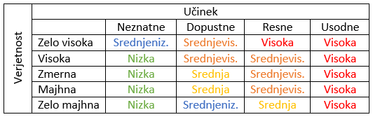

# :blue_square: Končna izdaja (celovito končno poročilo)

| [:arrow_backward:](03_Izvedljiv_sistem_2_porocilo_o_stanju.md) Prejšnji dokument |                       Trenutni dokument                       | Naslednji dokument |
| :------------------------------------------------------------------------------- | :-----------------------------------------------------------: | -----------------: |
| :green_square: **Izvedljiv sistem** (2. poročilo o stanju)                    | :blue_square: **Končna izdaja** (celovito končno poročilo) |                    |

![Terminski načrt](https://teaching.lavbic.net/plantuml/svg/hPVBRjiu58RtV0gYNJWrO3UYxCGT147HTWeKCq2BegiQNPnOj4DB9WMILXiFyWXvY7cNzBrwgCXAP54NTmRn8Zuc__zSFbBsQsD1snL8Q-cpBrnlX3Ine1BkxxHzHiY5iJS9loJvYdS2LXesz1z2gHKRdWZ9ypUK_et_lbM9qlJvahc_FFfUIViGnNqt6BfrEy74nQuti8XNMcrbLEpbi-Lq6HqgJj-_cVtvjjWEMgllTTVAcer8kB6gpEvtV1Q9CZng4l0McOZLjIqhlIKNBulk4UofJC7rxkf0oMgG1Z_YqfB1jOWuNIfbhzGFae1SRM75gKb8geMqPW49fzyvZvCRb0IxrH7SO4DuaImnA5kDi5Cs6PtYAw3270RPUIquzQt487iI98E7S3WAPddO5OAj4f8-ZquvBA_sA_3LiGAbpnfMx1SKMTONa4zQhVd2qfnXGnysi57mYf3vHRxXZt8abryHQMvvJCKkWpN8DT0K1JVS0Zq9NetP-CN5otpJvJTw3MdAfQ5WdweEvcqYXMDkrbFGa-Pm-66NgaIkUORod6QfXf__GY953CEXAtyuJBLQYaHejm1Z9m6rFEBoYHqOEdyNVAC966pCb28L1jF_3V5gLVsCV5LzXbs45uRb6SseYRSf7hkzfTXTeH_sT2SoQ2c8LNmeo6W_UcohIsDWA9THNkWnVdrgxEjDHYCQZ2aQQrW8v6Cqye_v4tAJg1NoWn37DgyxTDvI77g7U-_WeS4rT-RSyq1UkqUwKkB_O5Elw6CKGN4Sq1jASvpcR1osdWLtaM3YZGhL-VHIyvt_bShmmgt9LxlmzG3cMXF2HyeQ9O-LSj2mFj1yD7BhhXyZZEMRDcQcvJ0ddNNuTFi0qz-Z4HSyAgdIwlvE942LsopNMteo6qzQP-mUB8_4-4Kg5VGIR8R6wt003kkOzhGEZbVsM3a7JzW7dW-x33bTYwmOiwDduf_iMJdPMMSnNk5Ay_-pIIC-p8_FsNZQEctthUCH7zQDJo_1PdnO3tp2ZdcVrV5XBVZqbdFuJ0xn6VZu-Kl9-plfdfkkRIrtJy2wdYIb-zmZs-VgES9Yq4XFd3jpTt6NRJnXvvspPkTatY9HoR-VtA2P7O_30JcJZb47hEnsY-ZHOXxUSPHyuVs27GQTRGW3R4EZGXMANchaDQQP_t3z1G00 "Terminski načrt")

Končno poročilo naj bo edini vir za pregled poljubnega vidika projekta. Pričakuje se, da vsebuje posodobljene podatke o dodani vrednosti za naročnika iz [predloga projekta](01_Predlog_projekta.md), opredelitvi problema iz [1. poročila o stanju](02_Osnutek_sistema_1_porocilo_o_stanju.md) in opis sistema iz [2. poročila o stanju](03_Izvedljiv_sistem_2_porocilo_o_stanju.md). Razdelek [**9 Refleksija**](#9-refleksija) predstavlja retrospektiven pogled na celoten pogled. Vsebino iz prejšnjih poročil lahko ponovno uporabite, vključno z uporabniškimi zgodbami, primeri uporabe, kontekstnim diagramom in osrednjimi arhitekturnimi pogledi.

## :page_with_curl: Opisni naslov, osredotočen na prednosti za naročnika

## :information_desk_person: Ime ekipe: Člani ekipe

## 1 Uvod

### Začetni odstavek

Ob novozapadlem snegu se promet skoraj ustavi. Organizacije, ki se ukvarjajo s pluženjem, se na vso moč trudijo, da se situacija ne poslabša do te mere, da bi postala totalen prometni kolaps.
Naš projekt želi biti celovita rešitev organizacije pluženja, da lahko s tem pomagamo pri koordinaciji in nadzorovanju le tega pluženje naredimo učinkovitejše. Poleg tega želimo povezati pravne in fizične osebe, ki potrebujejo pluženje parkirišč in dvorišč, z izvajalci pluženja, kot so kmetje, da lahko zunaj plužne konice omogočimo to storitev, ki koristi obema stranema.
Tako postanejo Vaši stroški pluženja nižji, občani pa so bolj zadovoljni, saj lahko kljub snegu normalno potujejo. Občani bodo zadovolni tudi s spremljanjem pluženja v realnem času, saj bodo tako lahko videli, kdaj je pot, na katero se odpravljajo splužena, in lahko tudi vidijo, da bo do tega tudi prišlo in niso pozabljeni. Največji vpliv pa zna imeti povezovanje pomoči potrebnih in samostojnih plugov, ki skupnosti omogoči, da se s snegom spopade kot celota in ne kot skupek posameznikov.

### 1.1 Izzivi

Člani ekipe se bežno poznamo, ker smo se že nekajkrat videli na faksu, vendar še nikoli nismo med seboj sodelovali na projektu. Predvidevamo, da bodo največji izzivi za ekipo medsebojno usklajevanje, torej organizacija časa, čim bolj ustrezna delitev dela in dobra medsebojna komunikacija.
Prav tako noben član ekipe še ni sodeloval na projektu, ki bi vseboval ravno te tehnologije, kar predstavlja svojevrsten izziv. Večina nas pozna posamezne tehnologije, vendar njihovo povezovanje v nek celoten sistem nam je precej tuje. Algoritem za rešitev problema je zelo kompleksen, vendar obstaja na internetu že veliko rešitev, zato bo iskanje najprimernejše za naš specifičen problem tudi izziv. Ocenjevanje zahtevnosti posameznih nalog nam je tudi tuje področje.
Razvoj algoritma za rešitev problema optimizacije pluženja zna biti zelo kompleksna naloga. Tudi uporaba obstoječe rešitve bo verjetno zahtevno, saj ne bo perfektno naslavljala našega problema, temveč jo bo treba pametno prilagoditi. To zna biti zahtevno, saj takšna implementacija hitro izgubi na efektivnosti, če nismo previdni in iznajdljivi.
Prvi sestanek bo bolj družaben. Cilj njega bo team-building. Nato se bomo dobivali vsak teden, kjer bo vsak povedal napredek na svojem delu projekta, izzive in probleme, ki jih je srečal, ter predstavil tudi možne rešitve. Cilj nam je, da celotna ekipa ve, kaj se dogaja na vsakem področju projekta. Same delitve dela v skupini se bomo lotili po principu javljanja, torej bomo poskusili ustrezati željam vseh članom ekipe. Kjer bosta dva imela enako željo, bomo prišli do kompromisa. Za področja, kjer noben želja ne bo izražena, bo tisti z največ izkušnjami prevzel nalogo. Pri programiranju se bomo držali dobrih praks (sprotno pisanje komentarjev, sprotno testiranje, pred implementiranjem funkcije premislek kaj bodo vhodi in izhodi, grafična predstavitev, vnaprej definirane podatkovne strukture, programiranje po nekaj ur na dan več dni, ne pa en dan 10 ur…)
Ekipi sta že znana jezika Python in JavaScript, ostale tehnologije ter njihovo povezovanje pa nam še nista znana.

### 1.2 Poudarki

V okviru projekta smo ustvarili spletni vmesnik za vpogled in posodabljanje stanja na cestah MOC. Naš sistem podpira posodabljanje stanja na cestah ter dodajanje zahtevkov za pluženje.

### 1.3 Spremembe

- 24.4. Namesto izrisa poti navigiranja bomo plugu le izrisali oštevilčene marker-je na križiščih. To olajša rešitev, saj dosedanje rešitve za prikaz poti navigiranja niso delovale dobro. Poleg tega nova zastavitev bolje deluje z našim algoritmom in za uporabnika ne bi smela predstavljati problema.
- 3.5. Stanje cest v največ 7 barvah. Sprva smo stanje cest želeli prikazovati z barvo na zvezen način, a se je izkazalo, da brskalnik to težko podpira in začne delati bolj počasi. Iz tega razloga se omejimo na 7 barv.

## 2 Potrebe naročnika

Podjetji, ki opravljata pluženje, si želita intuitiven in zanesljiv nadzor nad situacijo pluženja, ter zmanjšane stroške pluženja zaradi višje učinkovitosti.
Občani in lokalna podjetja želijo možnost kontakta s kmeti, ki bi bili pripravljeni pomagati pri pluženju dvorišč in parkirišč, saj je to za večje površine izvajati ročno zelo zahtevno in zamudno, medtem ko kmet s plugom to nalogo opravi zelo hitro. Kmetje s plugom pa si želijo dostopa do nove potencialne storitvene dejavnosti.
Sistem mora vsakemu od deležnikov biti preprost za uporabo, brez nepotrebnih funkcionalnosti, zaradi katerih bi postal zapleten. Sistem mora biti robusten, saj, če se deležniki nanj zanašajo, njegova napaka lahko povzroči prometni kolaps.

### 2.1 Uporabniške zahteve

Kot neregistriran uporabnik želim:
- imeti dostop do zemljevida stanja spluženosti cest, da lahko preverim razmere.
- imeti možnost registracije, da lahko postanem Stranka.

Glede na to, da sem neregistriran uporabnik:
- ko zahtevam možnost registracije, sem preusmerjen na stran ki mi to omogoča.

Kot Administrator želim:
- na zemljevidu videti lokacije Ustaljenih Plugov, da imam pregled nad izvajanjem pluženja.
- ob kliku na Usataljeni Plug dobiti njihovo telefonsko številko, da ga lahko kontaktiram.
- imeti možnost urejanja števila plugov v štartni bazi in lokacije štartnih baz, da se podatki v zaledju spremenijo v realnem času.

Glede na to, da sem admin:
- ko kliknem na Ustaljeni Plug na zemljevidu, dobim njegovo telefonsko številko.
- ko zahtevam urejanje števila plugov v štartni bazi in lokacije štartnih baz, se te podatki posodobijo v roku 1 minute po oddani zahtevi.

Kot Ustaljeni Plug želim:
- da se mi glede na trenuten GPS izpisujejo navodila za nadaljno pot, da sledim optimalni poti pluženja.
- imeti možnost deaktivacije, da se lahko umaknem iz pluženja (zaradi malice, okvare, premora).

Glede na to, da sem Ustaljeni Plug:
- ko zahtevam deaktivacijo, je ta objavljena v roku 30 sekund.

Kot Stranka želim:
- imeti možnost oddaje zahtevka za pluženje, da lahko s tem naročim pluženje snega za zasebnem zemljišču.

Kot Samostojni Plug želim:
- videti trenutno nalogo, da se lahko odpeljem do nje in jo opravim.

Kot Manager želim:
- videti lokacije Samostojnih Plugov in ob kliku na dotičen plug dobiti njegovo telefonsko številko, da ga lahko kontaktiram.
- imeti možnost usmeriti dotičen Samostojni Plug na zemljevidu na določeno opravilo, da se mu posodobi trenutno opravilo.

Glede na to, da sem Manager:
- ko Samostojnemu Plugu spremenim opravilo, je ta o njem obveščen v roku 2 minut.

## 3 Cilji projekta

Projekt bo samodejno organiziral pluženje po približku optimalnega načrta plužnih poti. Poti bo spremenil ob sprotnem dodajanju in odvemanju plugov, kar naročniku omogoča večjo prilagodljivost. Na ta način bo zmanjšal stroške goriva dela, ter občanom izboljšal izkušnjo s prometom na dni sneženja.
Z delom aplikacije, ki samostojnim plugom omogoča povezovanje s pravnimi in fizičnimi osebami za pluženje parkirišč in dvorišč, bomo izboljšali kaotično stanje, ki nastane ob novozapadlem snegu. Tako bo delo lažje organizirano in razporejeno, saj se ne bo vsako podjetje potrebovalo dogovarjati z določenim opravljalcem plužnih storitev, da to poskrbi za njih. Prav tako lahko pomaga šibkejšim članom družbe, naprimer starejšim, ki svojih dvorišč ne morejo očistiti sami, kar povzroča tudi poledico in nevarnost poškodbe zaradi padca.

### 3.1 Primeri uporabe

##### Slovar pojmov

- UI - uporabniški vmesnik (User Interface). Je grafična podoba in osnovno delovanje spletne strani.
- Baza - podatkovna baza, baza podatkov.
- SCRUM master - vodja delovnega procesa skupine.
- Product owner - oseba, ki zajema uporabniške zahteve in jih komunicira ekipi.
- Samostojni plug - plužilec zunaj osnovnega okvira pluženja (npr. kmetje).
- Ustaljeni plug - običajni plug, ki je del sistema (npr. plug družbe Zelenice).
- API - aplikacijski vmesnik. Zunanja storitev, od katere prejmemo podatke.
- frontend - spletna stran in uporabniška izkušnja aplikacije.
- backend - zaledni sistem, kjer se procesirajo podatki in se izvaja poslovna logika.
- hevristični algoritem - algoritem, ki ne išče popolne rešitve, temveč čim boljšo rešitev na osnovi vmesnih približnih ocen prave smeri izvajanja. Je veliko hitrejši od algoritma, ki bi našel najboljšo rešitev. 
- Vite - okolje za razvoj frontend-a.
- Continuous Deploymentu - posodabljanje aplikacije ob vsaki spremembi kode.
- Python - programski jezik, ki ga uporabljamo za backend.
- JavaScript - programski jezik, ki ga uporabljamo za frontend.
- node.js - razširitev jezika JavaScript.
- GitHubCopilot - kot ChatGPT za programsko kodo.
- programski hrošč - napaka v kodi.
- refactoring - izboljšava preglednosti sicer delujoče kode.
- penetration tester - oseba, ki obvlada preverjanje ranljivosti vdorov v sistem.
- SQL injection - zlonamerna uporaba vnosnega besedila za spremembo baze.
- PyVRP - algoritem za optimizacijo poti.
- hosting - najem strežnika, od koder je dostopna aplikacija.

#### 3.1.1 Akterji, katere funkcionalnosti imajo na voljo.

Poznamo 6 vrst akterjev.
Neregistriran uporabnik je vsakdo, ki obišče osnovno spletno stran. Vidi lahko zemljevid stanja spluženosti cest in ima možnost registracije, da postane Stranka.
Admin je glavni upravitelj s sistemom. Njegova glavna naloga je upravljanje s štartnimi bazami pluženja in dodajanje novih akterjev (razen teh tipa Stranka).
Ustaljeni plug predstavlja plug znotraj obstoječega sistema pluženja, Samostojni plug pa je neodvisen delavec, ki pomaga pri pluženju, kot so pogosto kmetje, ki jim je pluženje dodatna dejavnost.
Stranka je lahko vsakdo, ki želi oddati zahtevek za pluženje neke površine na področju MOC. To so lahko fizične ali pravne osebe.
Manager pluženja opravlja koordinacijo plugov pri napotitvah na zahtevke za pluženje.

Akterjem je na voljo 12. funkcionalnosti, ki v ozadju uporabljajo še 8 podpornih funkcionalnosti. Določenemu tipu akterja je dostopen določen nabor funkcionalnosti. Ta nabor je predstavljen s terko številk.Oštevilčenost funkcionalnosti je na voljo spodaj.

Neregistriran uporabnik: (1, 2)
Admin: (1, 3, 4, 5, 10, 11, 12)
Ustaljeni plug (3, 6, 7, 9, 12)
Stranka (1, 3, 8, 12)
Samostojni plug (3, 9, 12)
Manager pluženja (1, 3, 4, 10, 12)

Uporabniške funkcionalnosti:
1. Dostop do stanja pluženja 
2. Registracija Stranke
3. Prijava
4. Kontaktiranje pluga
5. Urejanje števila plugov in štartnih baz
6. Aktivacija pluga
7. Deaktivacija pluga
8. Oddaja zahtevka za pluženje
9. Izbira naloge pluženja
10. Usmeritev Samostojnega pluga
11. Registracija osebja
12. Pridobitev pozabljenega gesla

Podporne funkcionalnosti:
13. Poskus registracije
14. Potrditev registracije
15. Posodobitev štartnih baz
16. Potrditev (de)aktivacije
17. Dodajanje zahtevka
18. Izbira zahtevka
19. Dodajanje uporabnika

#### 3.1.2 Primeri uporabe

Business value ocenjujemo na skali od 1 do 10, kjer 1 pomeni “zelo majhna poslovna vrednost” in 10 pomeni “ogromna poslovna vrednost”.
Pogostost uporabe ocenjujemo na skali od 1 do 10, kjer 1 pomeni “skoraj nikoli uporabljeno” in 10 pomeni “uporabljeno ves čas”.

##### 1. Dostop do stanja pluženja (MUST HAVE)
Dostop do stanja pluženja uporabniku izriše zemljevid pluženja, kjer so cest pobarvane glede na zasneženost oziroma čas od zadnjega pluženja, ter so vidne trenutne lokacije plugov.
Business value: 8
Pogostost uporabe: 10

Osnovni tok:
1. Uporabnik dostopa do začetne spletne strani sistema.
2. Zaslonska maska kliče GoogleMaps API in pridobi zemljevid območja.
3. Zaslonska maska od zalednega sistema pridobi stanje cest.
4. Kot del strani se izriše zemljevid stanja pluženja.

##### 2. Registracija Stranke (SHOULD HAVE)
Neregistriran uporabnik se lahko registrira v sistem in tako postane Stranka.
Business value: 6
Pogostost uporabe: 2

Osnovni tok:
1. Uporabnik dostopa do začetne spletne strani sistema.
2. Uporabnik klikne na gumb “Registracija”.
2. Izriše se registracijsko okno.
3. Uporabnik vnese svoje podatke (e-poštni naslov, uporabniško ime, geslo), pri čemer geslo vnese dvakrat, ter klikne na gumb “Registriraj me”.
4. Sproži se tok dogodkov primera uporabe “Poskus registracije”.
5. Primer uporabe “Poskus registracije” vrne sporočilo o uspešnosti.
6. Uporabnik je preusmerjen na začetno spletno stran sistema.
7. Sproži se tok dogodkov primera uporabe “Potrditev registracije”

Predpogoj: Uporabnik še ni registriran v sistem kot Stranka.
Popogoj: Uporabnik prejme e-poštno sporočilo, kjer lahko potrdi prijavo.

Alternativni tok:
Če na koraku 5 “Poskus registracije” vrne sporočilo, da registracija ni uspešna, uporabnika obvesti o napaki. (Primer: “Uporabnik s tem e-poštnim naslovom že obstaja). Tok se zaključi.

##### 3. Prijava (MUST HAVE)
Prijava obstoječim uporabnikom omogoči vstop v sistem in dostop do funkcionalnosti, ki so namenjene njihovemu tipu uporabnika.
Business value: 10
Pogostost uporabe: 8

Osnovni tok:
1. Uporabnik dostopa do začetne spletne strani sistema.
2. Kot del strani se izriše prijavno okno.
3. Uporabnik vnese prijavne podatke ter klikne na gumb “Prijava”.
4. Zalednemu sistemu je poslan zahtevek za prijavo.
5. Zaledni sistem vrne sporočilo o sprejetju prijave.
6. Uporabnik je preusmerjen na spletno stran, ki je primerna njegovemu tipu uporabnika.

Predpogoj: Uporabnik je potrjeno registriran.
Popogoj: Uporabnik lahko uporablja funkcionalnosti, ki so na voljo njegovemu tipu uporabnika.

Alternativni tok:
Če je koraku 5 vrnjeno sporočilo o zavrnitvi prijave, se o tem izpiše obvestilo. (Primer: “V podanem uporabniškem imenu ali geslu je prisotna napaka.”) Tok se zaključi.

##### 4. Kontaktiranje pluga (COULD HAVE)
Admin in Manager preko uporabe Kontaktiranje pluga pridobita kontaktne podatke izbranega pluga.
Business value: 2
Pogostost uporabe: 2

Osnovni tok:
1. Admin/Manager na strani Admin UI/Manager UI klikne na enega od plugov na zemljevidu ali enega od plugov v tabeli deaktiviranih plugov.
2. Odpre se okno s kontaktnimi podatki izbranega pluga.

Predpogoji:
Uporabnik je prijavljen kot Admin ali Manager.

##### 5. Urejanje števila plugov in štartnih baz (COULD HAVE)
Primer uporabe omogoča Admin-u, da spremeni lokacije štartnih baz in število plugov, ki posamezni bazi pripadajo. Tako vpliva na algoritem izbire najboljših poti.
Business value: 4
Pogostost uporabe: 2

Osnovni tok:
1. Admin na strani Admin UI klikne na gumb “Uredi štartne baze”.
2. Izriše se okno s tabelo štartnih baz, njihovih lokacij ter njihovo številčnostjo pripadajočih plugov.
3. Admin v oknu ureja podatke in klikne na gumb “Shrani”.
4. Izrisano okno s tabelo štartnih baz se zapre. 
5. Sproži se tok dogodkov primera uporabe “Posodobitev štartnih baz”.
6. Primer uporabe “Posodobitev štartnih baz” vrne sporočilo o uspešnosti, ki se uporabniku izpiše.

Predpogoj: Uporabnik je prijavljen kot Admin.
Popogoj: Podatki štartnih baz so posodobljeni.

##### 6. Aktivacija pluga (SHOULD HAVE)
Ustaljeni plug preko Aktivacija pluga svoj plug vrne v med aktivne pluge v stanju pluženja, če je bil predhodno deaktiviran.
Business value: 4
Pogostost uporabe: 3

Osnovni tok:
1. Ustaljeni plug na Plug UI klikne na gumb “Aktivacija”.
2. Sproži se tok dogodkov primera uporabe “Potrditev (de)aktivacije”.
3. Primer uporabe “Potrditev (de)aktivacije” vrne sporočilo o uspešnosti, ki se uporabniku izpiše.
4. Gumb “Aktivacija” se spremeni v gumb “Deaktivacija”

Predpogoji:
Uporabnik je prijavljen kot Ustaljeni plug.
Ustaljeni plug je deaktiviran.

Popogoj: Ustaljeni plug je dodan na seznam aktivnih plugov.

Alternativni tok:
Če na koraku 3 “Potrditev (de)aktivacije” vrne sporočilo, da aktivacija ni uspešna, se o tem izpiše obvestilo. Tok se zaključi.

##### 7. Deaktivacija pluga (SHOULD HAVE)
Ustaljeni plug izvzame svoj plug vrne iz stanja pluženja.
Business value: 4
Pogostost uporabe: 2

Osnovni tok:
1. Ustaljeni plug na Plug UI klikne na gumb “Deaktivacija”.
2. Sproži se tok dogodkov primera uporabe “Potrditev (de)aktivacije”.
3. Primer uporabe “Potrditev (de)aktivacije” vrne sporočilo o uspešnosti, ki se uporabniku izpiše.
4. Gumb “Deaktivacija” se spremeni v gumb “Aktivacija”

Predpogoji:
Uporabnik je prijavljen kot Ustaljeni plug.
Ustaljeni plug je aktiviran.

Popogoj: Ustaljeni plug je odstranjen iz seznama aktivnih plugov.

Alternativni tok:
Če na koraku 3 “Potrditev (de)aktivacije” vrne sporočilo, da deaktivacija ni uspešna, se o tem izpiše obvestilo. Tok se zaključi.

##### 8. Oddaja zahtevka za pluženje (SHOULD HAVE)
Primer uporabe omogoči Stranki, da je njihov zahtevek dodan v bazo trenutnih zahtevkov.
Business value: 6
Pogostost uporabe: 5

Osnovni tok:
1. Stranka na Stranka UI v okno zahtevka vnese podatke zahtevka ter klikne na gumb “Oddaj zahtevek”.
2. Sproži se tok dogodkov primera uporabe “Dodajanje zahtevka”.
3. Primer uporabe “Dodajanje zahtevka” vrne sporočilo o uspešnosti, ki se uporabniku izpiše.

Predpogoj: Uporabnik je prijavljen kot Stranka.
Popogoj: Zahtevek je dodan med trenutne zahtevke.

##### 9. Izbira naloge pluženja (SHOULD HAVE)

Samostojni plug ali Ustaljeni plug prevzame opravljanje zahtevka pluženja, ki je odstranjen iz baze trenutnih zahtevkov.
Business value: 6
Pogostost uporabe: 3

Osnovni tok:
1. Samostojni plug ali Ustaljeni plug klikne na gumb “Izberi nalogo”.
2. Odpre se okno z nalogami, ki so na voljo, in so uporabniku blizu po geolokaciji.
3. Uporabnik označi nalogo in klikne na gumb “Izberi”.
4. Okno z nalogami se zapre.
5. Sproži se tok dogodkov primera uporabe “Izbira zahtevka”.
6. Primer uporabe “Izbira zahtevka” vrne sporočilo o uspešnosti, ki se uporabniku izpiše.

Predpogoj: Uporabnik je prijavljen kot Samostojni plug ali Ustaljeni plug.

Popogoj: Zahtevek je odstranjen iz trenutnih zahtevkov.

##### 10. Usmeritev Samostojnega pluga (COULD HAVE)
Admin ali Manager lahko napotita Samostojni plug na nalogo iz množice trenutnih zahtevkov, če opazita, da je ta res nujna.
Business value: 1
Pogostost uporabe: 2

Osnovni tok:
1. Uporabnik klikne na plug na izrisanem zemljevidu.
2. Poleg kontaktnih podatkov se pojavi gumb “Usmeri”, ki ga klikne.
3. Izbranemu plugu je na njegov UI dodano rdeče obvestilo o usmeritvi z gumbom “Sprejmi”. Klikne ga takoj, ko lahko.
4. Sproži se tok dogodkov primera uporabe “Izbira zahtevka”.
5. Primer uporabe “Izbira zahtevka” vrne sporočilo o uspešnosti, ki se izbranemu plugu izpiše.
6. Izbranemu plugu se iz UI odstrani rdeče obvestilo.

Predpogoj: Uporabnik je prijavljen kot Admin ali Manager in izbrani plug je prijavljen kot Samostojni plug ali Ustaljeni plug.

Popogoj: Zahtevek je odstranjen iz trenutnih zahtevkov.

##### 11. Registracija osebja (MUST HAVE)
Admin lahko v sistem doda kateregakoli od akterjev.
Business value: 10
Pogostost uporabe: 2

Osnovni tok:
1. Admin klikne na gumb “Dodaj uporabnika”.
2. Izriše se okno v katerem lahko izbere tip uporabnika in vnese njegove podatke. Klikne na gumb “Dodaj”.
3. Sproži se tok dogodkov primera uporabe “Dodajanje uporabnika”.
4. Primer uporabe “Dodajanje uporabnika” vrne sporočilo o uspešnosti, ki se izpiše.

Predpogoj: Uporabnik je prijavljen kot Admin.
Popogoj: Uporabniški profil je dodan v sistem.

Alternativni tok:
Če na koraku 3 “Dodajanje uporabnika” vrne sporočilo, da dodajanje ni uspešno, se le-to izpiše.

##### 12. Pridobitev pozabljenega gesla (MUST HAVE)
Če uporabnik pozabi geslo ga lahko pridobi preko e-pošte.
Business value: 10
Pogostost uporabe: 4

Osnovni tok:
1. Uporabnik klikne na gumb “Pozabil sem geslo”.
2. Izriše se okno za vnos e-poštnega naslova. Uporabnik klikne na gumb “Potrdi”.
3. Sproži se tok dogodkov primera uporabe “Pozabljeno geslo”.
4. Primer uporabe “Pozabljeno geslo” vrne sporočilo o uspešnosti, ki se izpiše.

Predpogoj: Uporabnik je predhodno že bil dodan v bazo uporabnikov.
Popogoj: Uporabnik je prejel e-pošto z geslom.

 Podporne funkcionalnosti:

##### 13. Poskus registracije (SHOULD HAVE)
Poskus registracije uporabnika pripravi, da lahko potrdi svojo registracijo.
Business value: 6
Pogostost uporabe: 2

Osnovni tok:
1. Dobimo zahtevek za registracijo s podatki o uporabniku.
2. Preverimo, če uporabnik s tem e-poštnim naslovom že obstaja.
3. Dodamo ga v bazo še nepotrjenih uporabnikov.
4. Vrnemo sporočilo o uspešnem vpisu.

Popogoj: Uporabnik je vpisan v bazo nepotrjenih uporabnikov.

Alternativni tok:
Če v koraku 2 ugotovimo, da je uporabnik že v naši bazi, vrnemo sporočilo o neuspelem vpisu.

##### 14. Potrditev registracije (SHOULD HAVE)
Potrditev registracije zaključi registracijo uporabnika po tem, ko jo je potrdil na prejetem e-poštnem sporočilu.
Business value: 6
Pogostost uporabe: 2

Osnovni tok:
1. Zaledni sistem pošlje e-poštni naslov uporabnika.
2. Preverimo, če je uporabnik s takšnim e-pošnim naslovom prisoten v bazi nepotrjenih uporabnikov, ter pridobimo njegove ostale podatke.
3. Sproži se tok dogodkov primera uporabe “Dodajanje uporabnika”.
4. Primer uporabe “Dodajanje uporabnika” vrne sporočilo o uspešnosti.
5. Uporabnika odstranimo iz baze še nepotrjenih uporabnikov.
6. O uspešni prijavi ga obvestimo na e-poštni naslov.

Predpogoji:
Uporabnik je vpisan v bazo nepotrjenih uporabnikov.
Uporabnik še ni vpisan v bazo uporabnikov.

Popogoj: Uporabnik je vpisan v bazo uporabnikov.

Alternativni tokovi:
Če v koraku 2 ugotovimo, da uporabnik še ni v naši bazi uporabnikov, ga na e-poštni naslov opozorimo o nenavadnem delovanju. Tok se ustavi.
Če v koraku 4 dobimo sporočilo o neuspešnem dodajanju, uporabniku na e-pošto posredujemo vzrok napake. Tok je zaključen.

##### 15. Posodobitev štartnih baz (COULD HAVE)
V zaledju se spremenijo podatki o štartnih bazah.
Business value: 4
Pogostost uporabe: 2

Osnovni tok:
1. Dobimo podatke o željeni spremembi podatkov o štartnih bazah.
2. V bazi spremenimo podatke.
3. Vrnemo sporočilo o uspešnosti.

Popogoj: Podatki o štartnih bazah so posodobljeni.

Alternativni tokovi:
Če je sprememba podatkov v koraku 2 neuspešna, vrnemo sporočilo o neupešni spremembi.

##### 16. Potrditev (de)aktivacije (SHOULD HAVE)
Sprememba stanja aktivnosti pluga.
Business value: 4
Pogostost uporabe: 5

Osnovni tok:
1. Dobimo zahtevek za spremembo, ki vsebuje šifro pluga in željeno stanje (aktiviran/deaktiviran).
2. Preverimo trenutno stanje pluga.
3. Spremenimo stanje pluga.
4. Vrnemo sporočilo o uspešni spremembi.

Predpogoj: Plug je že zaveden v bazi.
Popogoj: Stanje pluga je enako kot v zahtevku.

Alternativni tokovi:
Če v koraku 2 ugotovimo, da je trenutno stanje že enako željenemu stanju, vrnemo sporočilo o uspehu, ter sporočilu dodamo, da se stanje ni spremenilo.
Če v koraku 2 ugotovimo, da plug ni zaveden v bazi, vrnemo sporočilo o neuspehu ter povemo, da pluga ni v bazi.
Če v koraku 3 ne uspemo spremeniti stanja pluga, vrnemo sporočilo o neupehu, kjer dodamo, da je prišlo do neznane napake in naj uporabnik poskusi kasneje.

##### 17. Dodajanje zahtevka (SHOULD HAVE)
Zahtevek za pluženje je dodan med trenutne zahtevke.
Business value: 6
Pogostost uporabe: 5

Osnovni tok:
1. Dobimo podatke zahtevka.
2. Preverimo, da uporabnik, ki je zaveden na zahtevku, res obstaja.
3. Zahtevek dodamo na seznam trenutnih zahtevkov.
4. Vrnemo sporočilo o uspehu.

Predpogoj: Uporabnik v podatkih zahtevka je vpisan v bazo Strank.
Popogoj: Zahtevek je dodan med trenutne zahtevke.

Alternativni tokovi:
Če v koraku 2 ugotovimo, da uporabnik še ni v naši bazi Strank, ali v koraku 3 ne moremo dodati zahtevka na seznam trenutnih zahtevkov, vrnemo sporočilo o neuspetju. Tok se ustavi.

##### 18. Izbira zahtevka (SHOULD HAVE)
Plug je izbral zahtevek, zato zahtevek ne bo več na voljo.
Business value: 6
Pogostost uporabe: 3

Osnovni tok:
1. Dobimo identifikator zahtevka in podatke o plugu.
2. Preverimo, da je zahtevek na seznamu trenutnih zahtevkov in da plug res obstaja.
3. Z namenom deaktivacije se sproži tok dogodkov primera uporabe “Potrditev (de)aktivacije”.
4. Primer uporabe “Potrditev (de)aktivacije” vrne sporočilo o uspešnosti.
5. Preverimo, da je zahtevek še vedno na seznamu trenutnih zahtevkov.
6. Zahtevek odstranimo iz trenutnih zahtevkov.
7. Zahtevek dodelimo plugu.
8. Vrnemo sporočilo o uspešnosti.

Predpogoji:
Zahtevek je na seznamu trenutnih zahtevkov.
Plug je v bazi plugov.

Popogoji:
Zahtevek ni več med trenutnimi zahtevki.
Plug je deaktiviran.

Alternativni tokovi:
Če v koraku 2 odkrijemo napako, vrnemo sporočilo o neuspešnosti z navedenim razlogom.
Če v koraku 3 dobimo sporočilo o neuspešnosti, vrnemo sporočilo o neuspešnosti z navedenim razlogom.
Če v koraku 5 ugotovimo, da zahtevek ni več na voljo, vrnemo sporočilo o neuspešnosti in opozorimo plug, da je morda bil deaktiviran kljub neuspetju pridobitve zahtevka.

##### 19. Dodajanje uporabnika (MUST HAVE)
Admin lahko dodaja vse vrste uporabnikov.
Business value: 10
Pogostost uporabe: 2

Osnovni tok:
1. Dobimo zahtevek za dodajanje uporabnika.
2. Uporabnika dodamo v bazo.
3. Vrnemo sporočilo o uspešnosti.

Popogoj: Novi uporabnik je prisoten v bazi uporabnikov.

Alternativni tokovi:
Če v koraku 2 ugotovimo, da je uporabnik že prisoten, uspešnemu sporočil dodamo obvestilo, da je uporabnik že predhodno obstajal.

##### 20. Pozabljeno geslo (MUST HAVE)
Pošiljanje pozabljenega gesla na e-pošto uporabnika.
Business value: 10
Pogostost uporabe: 4

Osnovni tok:
1. Dobimo zahtevek o pozabljenem geslu z e-pošto uporabnika.
2. Dobimo geslo iz baze uporabnikov.
3. Pošljemo geslo in uporabniško ime na e-poštni naslov.
4. Vrnemo sporočilo o uspešnosti.

Popogoj: Uporabnik s takšno e-pošto obstaja v bazi uporabnikov.

Alternativni tokovi:
Če v koraku 2 ugotovimo, da takšnega uporabnika ni, prekinemo tok.

#### 3.1.3 Sprejemni testi

### 3.1.4 Diagram primerov uporabe

#### 3.1.5 Nefunkcionalne zahteve

Sistem mora delovati za simultano organizacijo do 100 plugov.
Plug pa je avtomatsko voden v smeri njemu začrtanega pluženja. Posodabljanje informacij se dogaja v realnem času, torej se za potrebe pluženja mora posodobiti v največ eni minuti od zadnje spremembe stanja plugov na cestah in sprememb informacij o štartnih bazah.
Zemljevid stanja na cestah je na voljo tudi neregistriranim uporabnikom in prikazuje stanje za največ 5 minut nazaj.
V okviru organizacije opravljanja zahtevkov za pluženje moramo v primeru MOC omogočati hranjenje vsaj 30.000 zahtevkov naenkrat.
Omogočati moramo registriranost za vsaj 70.000 strank, ter hkratno prijavljenost za vsaj 5000 strank.

### 3.2 Merila uspeha

- Kako veste, ali je naročnik dobil želene koristi?
- Katera merila uspeha so pomembna naročniku?

## 4 Opis sistema

### 4.1 Pregled sistema

- Predstavite sistem in glavne izzive.
  - Povzemite utemeljitve izbranih načrtovalskih odločitev.
  - Narišite kontekstni diagram, ki prikazuje, kako sistem sodeluje z zunanjimi storitvami, podatkovnimi bazami ipd. Jasno označite meje sistema.
  

- Na kratko pojasnite zunanje interakcije sistema.

### 4.2 Osrednji arhitekturni pogledi

- Za vsak pogled zagotovite osrednji diagram.
- Za arhitekturne elemente v diagramu dodajte katalog elementov z imenom in namenom vsakega elementa.
- Za vsak element določite enega člana ekipe (tudi, če je več članov ekipe prispevalo k elementu), ki bo njen skrbnik.

    - #### **Komponenti diagram**
  

  - #### **Deployment diagram**
  

 - #### **Diagram zaporedja**
 

- #### **Diagram aktivnosti**
  

ZA POPRAVIT
- #### **Razredni diagram**
  

## 5 Končno stanje

- Kaj deluje? Vključite posnetke zaslona.
- Katere teste ste izvedli?
- Ocenite ustreznost testov.
- Koliko vrstic kode ste napisali (vse skupaj)?

## 6 Vodenje projekta

- Opišite uporabljen razvojni proces.
- Kateri so bili ključni dogodki med projektom? Vključite tudi datume.
- Še kaj drugega?

#### Dnevnik sprememb:
- 29.2. Začetni nabor idej za možne funkcionalnosti. Zažetek projekta.
- 7.3. Omejitev idej, ki jih želimo podpirati.
- 13.3. Ob stoječem sestanku smo dokončno razjasnili želje uporabniške zgodbe in arhitekturo. Sedaj definiramo potrebovane funkcionalnosti.
- 29.2. Začetni nabor idej za možne funkcionalnosti. Zažetek projekta.
- 7.3. Omejitev idej, ki jih želimo podpirati. Želeli smo utrditi svojo vizijo projekta s povečanjem fokusa na manj idej. Napredovali smo hitreje.
- 13.3. Ob stoječem sestanku smo dokončno razjasnili željene uporabniške zgodbe in arhitekturo. Želeli smo pojmovanja sistema združiti na enem mestu. Sedaj lahko definiramo potrebovane funkcionalnosti.
- 27.3. Odločitev za dodato uporabo Google Maps in delitev razvijalskih vlog za specifične dele sistema. Želeli smo si olajšati delo navigacije na kratkih razdaljah, saj bi težko dosegli raven uporabnosti, ki ga že ponuja Google Maps. To nam bo omogočilo lažje napredovanje s projektom.
- 28.3. Odločitev za hevristični algoritem. Sprva smo želeli napisati algoritem, ki bi iskal optimalne poti pluženja, a smo ugotovili, da je to prekompleksna naloga. V nadaljevanju bomo poskusili uporabiti hevristike, ki bodo našle dobre rešitve pluženja, četudi te ne bodo optimalne.
- 3.4. Odločitev za kasnejši razvoj algoritma. Ker se je uporabniška zgodba uvedbe samostojnih plugov zdela dobro sprejeta in nas razlikuje od ostalih ekip, smo se odločili, da damo poudarek na njen razvoj. Razvili jo bomo preden začnemo razvijati algoritem.
- 17.4. Dogovorili smo se, da bomo znotraj obstoječega repozitorija imeli povezavo na nov repozitorij, od koder se bo naša spletna aplikacija avtomatsko deploy-ala.
- 18.4. Za frontend bomo namesto create-react-app uporabljali Vite, saj omogoča delo s Shadcn in je bolj splošno uporabljano, zato zanj obstaja več pomoči na forumih. 
- 24.4. Namesto izrisa poti navigiranja bomo plugu le izrisali oštevilčene marker-je na križiščih. To olajša rešitev, saj dosedanje rešitve za prikaz poti navigiranja niso delovale dobro. Poleg tega nova zastavitev bolje deluje z našim algoritmom in za uporabnika ne bi smela predstavljati problema.
- 3.5. Stanje cest v največ 7 barvah. Sprva smo stanje cest želeli prikazovati z barvo na zvezen način, a se je izkazalo, da brskalnik to težko podpira in začne delati bolj počasi. Iz tega razloga se omejimo na 7 barv.

#### Izvajani procesi in prakse
Uporabljali smo SCRUM in Extreme Programing.
Tedensko smo se dobivali na stoječih sestankih ob tabli pred enem izmed laboratorijev, ki imajo tablo. Začeli smo z naslovitvijo težav zadnjega tedna ter kako daleč je vsak posameznik prišel, potem pa skupaj zasnovali delo naslednjega tedna. SCRUM master je razdelil naloge.

V naslednji iteraciji želimo zgraditi glavno stran z zemljevidom, ki prikazuje trenutno snežno stanje na cestah ter osnovno delovanje algoritma. Podpirati želimo začeti osnovne pluge in administratorske dožnosti.

### 6.1 Usklajevanje ekipe

Sestajali smo se vsako sredo po predavanjih ter komunicirali preko Discord-a.
Po potrebi smo se sestali tudi v četrtek pred vajami.
Med sestanki smo pregledali stanje projekta, ocenili napredek od zadnjega sestanka ter razdelili naloge, ki naj bi jih člani ekipe morali opraviti do naslednjega sestanka. Pogovorili smo se o problemih, ki so se pojavili v preteklem tednu in jih poskusili nasloviti. Začrtali smo delovanje nadaljnjih funkcionalnosti ter definirali njihovo arhitekturo.

### 6.2 Projektni načrt

**SEZNAM IZDELKOV**

1. iteracija (21 dni)
- Pregledani podatki in začetna vizualizacija (1 dni)
- Zapisnik snovanja idej pristopa k algoritmu (2 dni)
- Zapisnik pregled obstoječih rešitev (2 dni)
- Definiranje uporabniških zgodb in funkcionalnih zahtev (2 dni)
- Predloga projekta (4 dni)
2. iteracija (21 dni)
- Izvedba okrnjenega algoritma planiranja s pomočjo PyVRP (10 dni)
- Izdelava simulacije naključnega nabora voženj po mestu - kot merilo uspešnosti algoritma pluženja (8 dni)
- Obdelane .shp datotek kot predpriprava za izvajanje algoritma (1 dni)
- Home page UI: vsebuje zemljevid stanja cest, login (2 dni)
- Avtentikacija Admin-a in Ustaljenih Plugov (1 dni)
- Admin UI - lokacije plugov, št plogov v bazah... (8 dni)
- Ustaljeni Plug GPS sharing - vsi aktivni Ustaljeni plugi delijo svojo lokacijo z Adminom. (3 dni)
- Ustaljeni Plug UI - glede na trenuten GPS se mu izpisujejo navodila za nadaljno pot, možnost deaktivacije/pavze (3 dni)
- Testi enot. (2 dni)
3. iteracija (28 dni)
- Vključitev kmetov v pluženje z VOC in Zelenice (4 dni)
- Razvoj svojega algoritma organizacije pluženja (14 dni)
- Ročno testiranje sistema kot celote (4 dni)
- Izdelava dokumentacije sistema kot celote (2 dni)
4. iteracija (28 dni)
- Načrtovanje poti neregirstrianim uporabnikom (8 dni)
- Nadaljnji razvoj algoritma organizacije pluženja.
- Posodobitev pomembnosti posameznih cest glede na njihovo priljubljenost. (1 dni)
- Ročni testi za testiranje sistema kot celote. (4 dni)
- Integracijsko testiranje tretje iteracije s prejšnjima (4 dni)
- Vsi testi enot. (4 dni)
- Celotna dokumentacija kode s popravki (2 dni)

![Ganttov diagram](https://teaching.lavbic.net/plantuml/png/dLdTRgD65BxtKupQYswZhhjnicfQLLLPcpXi7MFX7tMtggoncTXZOCQ2WJQk-WXvY7sHNYNlrJC3XW4JuqI950UO-Rxpyvrp6FyQ2HoA5MP2eA_wyWzFa4lnAiJ1LwtMpv6uzyalBVL0BxsC_caX96X0VCg8-WUX0NpiSf-7wEkxZlnHLwyv4-bLM7SFb_wLAt7aPQi-uAMt2ddCt6mjkRfxV-TMTtn__U7Ax6RBuHU78V_h4BZqM41z4WcU4tmDrDBd4N6Vsw3MJf-krY8tzj_Mpzzd3cn57cLRBDstgEmaGimYk4MOQAsfIz0TvsB1_sxvcArYl28eybkjRSWtP2cGYbU4n9gWyn_56l4xT4qMOOp3UzHvrxbiHLZ4eOll8_0JoMneHO1MkTJwu-ni519t6z9jY1DoTeRU_81SHh_z4-48_J5opDwVoCSHeC5rMAsMdBSH5IJ4Ixh1PsTlEkVQ4cjYEkVxDHVeBq8yW6JkdZGMsRRVH8Z0PRcVjLlG42Ewsz44_Z34iBp0DWI1BpQILGdYymVBCVOOvoYrwbc8pCYL3t7SSXSB3z8RG7RuyO48Xb52Tp7swIwpfmm66_K7XHVgqJ961TwOyIJdZy2za8TRZ3o4_HKFgGXYYTFHSCP3UsOCFvfxeCvpPYasXvRn1K1ioEC3NQEGF7s102LLZ6prt377vl3ZIv7682RCF8fSSaUPYWz6J_yHVqD0OYbccaAw_yRcU68CVxCQmwKpAq1xEHP1yPQ7UC7eqnSFZDojkBkGSRoBcRUad66VoSjuNMDvpxosXX2YHWVdT3KFWmOp1Wn7u6iLrop_oO6F1yP9G3gZmsYwt8i3A0Rr49cpUdRtDHZMpYK-1g5jGVa-NyaFa3cUKBb_MH9QpnmOirngbqTZ9-deA0bn5nZoGeGysiBsDAcuJKyJnvmuTYb73ZMMaIam7B8ZOS8W8p4xsD3wV7Ix533RIsxMAHKrT5ZLEWrLBQryfRAMke1x8PCQ0K_lvGy-tsSLHX6KfO0_Fcmu6jtFd94ovPqUy4zmDRVcNNq9qj0b-EUqkb4Kubt2DsfnXG8FeQMdPOy0dnYqBEb0HOGowUCLHMkIoD95lMeATgVZYNqxDmPzsx4cDxSDjKJnrtoTfs14WzXF2J3i-PluyK6HX0O0MaS9Lvo03mgW-iJeBVAuWCyXzJcA8QsUlZ0E14kEpGoHdA_qIcJTJWV6nBA7UxPN9tdINcHasz5w2oi45yHJFBP5wyHGUA219NYZ2aLEvw0Stepc89XHGp-fKBZX0KH8ZW5JwoUKH6GH0yYE151x4wgMoiWjmKVV8P0qPTM0tTYtvdnaz1kgKXNOI0HK8UefLI333IXxgphq51R9mWyLT-J7AvvK3JMcanjpEB6w9O_NcrkGqv0b5fWB-xu5axmyIm7hE_Jq1RmFXa8dJs2OWgBVRhVBuJPwjzPmFhME5wyApG8_Dr3PX_gZCOhMEAHi1NoI239ELZIuNJmeoSdkw5DGSWIYutlY7ErIv_6WBHrreV64dUVZ6yEnXlsYmDHItHlqBCcf1Tna_v1gWfcIi1Z2bt8dA8WXGRSqWjG1GWmdtAM-obk6NTY6ST0Pv4y0efEY0akKZShptszniYDLxgF1jA-v-6JU4qZKhAKInaMxcgtJeJMPJw0L7y_MWogapGrP0yrGFEwITZL5ktRFr9jeVN8MN4fjEWv9AdLedlADAF9I5FGc97TuARXCbMyFB7FCQwCxiVLelzYsve6at3rW8faFpTydn-tKcRseZLUx-0bO1IMjALnK6_1LfG5V559-jW5tDEwpjA78IHXv0H6gMEpR0vHFDBExifPz9Zv8Q4cguy-ruToQplXu0Qc2EccxbV8_fTkgQ5tMTzRSXvSlpH07fWcGioXa5a4R9y12jgqbyQ65LQqTVnfFpDkIwXfnwwRAqkZw36xd4BTncDNvlKWBvtLQcFTcvl4SrNWroG4ghTWq3RSATjOvKHYAdoQEooPnN5R5KPUe5vefGnWGGv6zfaBXfuWHUFkWOIH22auDylSjZmVLMKfhMlFf45u0caUgChPgE9jyEcsIYQoZcIYd3dHiPzupPxahVtX9ml28ktoXYWACtIHOf0FabaSu83ivqCWngcYZm7BD4ovVug6SB6IxXGK7pSInZTvyP8zWn0GrVZeUPjq8BSYdoBPzHBTpUsOwnc1mNBzLfbfsCq5MAiSYhqIZck3obGNw7mpV6neSlZOE9sRVKGFL2UNaUJfrKy9btPGmltWjHCsOSF2gaqq91KZd-9mmlpXnKZXzL7WTjbr8gNZ7Lp3lIwS9zaUp2xdZQ32D8q89w8GXuQAs7BuAKBLsy9zqwKWxkL3wW57uyG57kRaPvCpkQTtqX4F9_HaZZT2I-nnYwCfHmI5WS7uaM7UpECSxiZG_WQlT8JyngxjREicgXT0Ee8vHK0stxe7YrAVkRdPGKtjB7hdKGgRd5tMt3WyI6fvwncVwy5BtGAbjr9Alrky6cABMrdkffDtwE9HqL_U8ojhAZO7yTg4V4i9QlqAggYzb_WS0 "Ganttov diagram")

*Ganttov diagram*

![PERT diagram12](https://teaching.lavbic.net/plantuml/png/jLZRSjiu4dtdLtHD7cQtod4iIhuaut8LOz4sDxQaeYHlZMkgL908oH0fGilRxcWodv2Fo8_CK_9Vsm0l8aZAaJAL5qewe823HgFxT8SkyzSa82kOafcx27ZiEzVSum540V537A9-f7bq7a748M2BvmWS5j1PnBYlQU6CU1HEZYyqxJACVlVebHP69A9THXPYqZyq0184_B_o6y0zysaw_TJ3zH3xK_jJktoJ_LSB2pf3COtyr_iAiLVqOduwTyG83nmQPEZfpViBynfdAqtYq3c9lMX4_nSP7bluAzmCpF110-tdqcjh1lg9bbA7dovdOiPtjm6b_jKWI0WGDsA9pyFeyeqSk_e9I0W3s-mER6jW6uy6l9hFwHaz-yN37RvpIE06r85tS9dXHzddrKSuXuzm0lBpD_-ZiCh95gbmUE_5zAfr30mPanbR4eM0DJBjbhgo-4FpidehNG7q2sNX76hSlRMPie00ssmOce7vu1C1-4iApA5BbStJUyisykD9wSXP99yKFSe-aKzEfyvc5vb1G1SUMdND7HAvF15yDkJB9nhv11AsYOd7DdKhuJ7TtflTWuWX1NYh4CkGHc93doU5JM0Ti33YQm8k46_10nQjOeNGiDT_D7h_ClTcfAThGwkbKCgX5ut5fqXcIRzyOiyGqA-VqPEI9lDC1lskCVhGV_oXh8OKKTzbucOoNteIWQz_KMz9VPhnIwXgBNCuCdeVh8FEhoKVkaAim1gPTGj25E8r3yZKPry_ksYrpO8xK-5hyzXtPnZsYESBc3nNJTarRwmUte53pxOb7nsLROurdwv7Sh8-2V6SfVTbGKArt-3U-2vE7V4uKpdbs8iUvt0t5e6sWKhcQjt-zG_cOcqSwX4CMMiCmnvVY2zu2zoe4a2VkkQzZDvxiiaNnNIXiicnflXjRHBgJ0cwTnJmS4r5CjbrMhOvill3WVbXP3qQ4skqTtXlPGHad2ynAx0cPZRTq23nyJeIlqBZoRIhMUqRYyk7UkKAh6bn_QMqfX-KriGIq6chQ-TOPUrhlDjUSIRS3NmHUz13yc2DlfBVBW8XPfiL__9foM7m-wCzKFtvLqHKedBs7KOgMBNrEjEsleFfKvhX60Haa_0bU2ICAdnvi432ClLH91zZG1NSCIjYglJ8Wi4pJKHMOgx2_tey7FKV9iRzRTyQtJsWk-bxxoRd36qrRXNOo_SoPAlOImdxnFMMyPTFSbEeBt1DIBZS0_A75QQC6Ce9mNeOtniZgz_R-zfU55O-QR3yoGwo_Mb6zZXyNkCLYNX4NN1v9ACAflbr84OtGXybP2cZSN4eQWwx6qnkh7jpEC4GE3WeaqcAUeDhw-qTjE_u2hs0B2YChNUGX7GQ8x4DNM6IJPW38WEZTypGhaU0iP6fL_-k_s1E1iRjOUaYfTHfeBdB5OmamYJ1N7d_mN1Mp7yj9UOOtnPw07Fim8iNNCsnndXqP_P6rlLX7j3Ag81-gdBCiMQEWXMQ4LwZeTpYVY6d8_Zw6Vq0pOSwDC7Y2UN0yV6nIhNxOFKcO-kWx2AuWAvgpm9h95dOIveBRWT329z9mFm5qav2bbKlR6jOkGUXmJo6SIt4gCBp_N7Of6V1L-fcSDh9yCwmhTxjtljfPxHh0UzjSy1ht8-qlayIxZ1FNhOrNa0XD4Jam2gL-d7aI_x7Hx32k27gDDoRtBKyiZThacogecXyUyZ9VDzEHdZ5CfL6VQuMZ-EUDPgCKDl2gsbxFf-sgnnIz2Zxp2EkS96sgeGAhCB1-4zCjW5tjogxxdTD8Sd63tYlvAtA4m5fdsM9GCoLvG417icvqribLeQsMimMs2wX60SqZPSeoqIZ87Gf1bOyqdy4MBBF8YxSzv_75KroOroF-ga7_Y2RVPUwHdErzmz49vbfe5EnMOvLADdK-LiAifBIxLrjYLQsF7JKYhp0cZHS-oKDrzvRmrraIy2vUam5rdXCZwbk41Kjk2iQoKYSon_CUF28TGR6xoVgOJIPgMQwCUm7qnuU59ibdLEzJl5qbtYpKyqcGkm-acsNEbDPRbLPtRiw6HiuKorPO8sMj57XOWoDjl4gHBL8aQTGEpFgeV9H1Sslmv7vS5ZywcGCu5mLOGMsV_pQavwiC_SCO-Uo-wJMJWNMvFgTbro_Sv3hYoNWhPhp2-p5MhlKgQ0lXFZnqBHJQ-nvLgsSmRbUPtMkVuCLHdAU7r4zrTZcesN-UsygxMBPJWELpZVS1gz_MQXpno52yb1KE2GGMSSdgE6g7IVKROQD8dXWslixaF3lSrLT5fYcAStYrw-lqkQjbhPmvM_PFjMoBgf0idQ9bZSm1PRt3XMmsiBJQZqz-TUiaQOL_KSLpVji0YrrihHoLqkkLZIKwaFR1ezMRlQa-qjxBLhHT15ehTzHiaZMXD1A7QpSSBgMDWdaeg8AroebbXXeA6-RNjlMawL9rVTA0qLvLCBKcaIhb2ZoZQmKq8gQGA0bJQqEPF9KIniCk_RILBwBTmjfgPLAvSf0tGpRmMq5gE8D-zeEbki3TIJNsYgwrR_fKHVQJYlhlDpVXCIg3TIKJksDPcch5Q8jTwUsbkeLyJiJ1YMaPESIMag1vPEeZPLJPMbCN95IcigPTBGqVKXZPL6x19K2Q0bL0fPM3hBrqI8Lr8R-3m00 "PERT diagram12")

*Graf PERT**

### 6.3 Finančni načrt
Časovno zahtevnost izdelave aplikacije bomo ocenili s pomočjo modela COCOMO 2 za zgodnji model načrta.

Pri tem bomo za izračun uporabili sledečo formulo:

$$ effort_{ČM} = A * size^B * M $$

kjer bomo dobili rezultat v človek-mesecih.

Za parameter A bomo privzeli vrednost 2,94.

#### 6.3.1 Ocena obsega aplikacija
Velikost aplikacije ocenimo tako, da jo razdelimo na funkcionalnosti in vsaki od njih določimo utež glede na njen obseg. Tipi funkcionalnosti so sledeči:
- Zunanji vhod (External Input - EI)
- Zunanja poizvedba (External Query - EQ)
- Zunanji izhod (External Output - EO)
- Notranja logična datoteka (Internal Logical File - ILF)
- Zunanja vmesniška datoteka (External Interface File - EIF)

| Vrsta FP | Ime funkcionalnosti | Obseg | Utež |
|----------|---------------------|-------|------|
| EI       | Prijava v sistem						| LOW | 3
| EI       | Zahteva za predviden čas prihoda		| LOW | 3
| EI       | Zahteva za izračun plužnih poti		| AVG | 4
| EI       | Posodobitev podatkov o voznem parku	| LOW | 3
| EI       | Oddaja naročila za pluženje			| LOW | 4
| EI       | Potrditev naročila za pluženje			| AVG | 3
| EQ       | Prikaz stanja na cestah				| LOW | 3
| EQ       | Izpis podatkov o določenem plugu		| LOW | 3
| EQ       | Izpis naročil za pluženje				| LOW | 3
| EO       | Izračun optimalnih plužnih poti		| AVG | 5
| ILF      | Interna podatkovna baza				| LOW | 7
| EIF      | Baza vremenskih podatkov				| LOW | 5
| EIF      | Baza geografskih podatkov				| LOW | 5
| vsota ||| 51

Pri implementaciji bomo večinoma uporabljali jezik JavaScript, za katerega velja, da ena funkcijska točka ustreza približno 47 vrsticam izvorne kode. Izračunani obseg je torej
$$ size = 51 * 47 = 2.397 KSLOC $$

#### 6.3.2 Parameter B
Parameter B izračunamo iz 5 dejavnikov, ki opisujejo lastnosti projektne skupine.

| Dejavnik | Opis | Vrednost | Utež |
|----------|------|----------|------|
| PREC	   | Stopnja precedenčnosti 			 			 | zelo nizka | 5
| FLEX	   | Stopnja fleksibilnosti zahtev 		 			 | visoka 	  | 2
| RESL	   | Stopnja pripravljenosti na tveganja			 | nominalna  | 3
| TEAM	   | Stopnja uigranosti skupine 					 | nominalna  | 3
| PMAT	   | Zrelostni nivo razvojnega procesa po modelu CMM | zelo nizek | 5
| vsota    |      |			 | 18

Vrednost B je za naš projekt torej enaka
$$ B = 1.01 + 0.01 * 18 = 1.19$$

#### 6.3.3 Parameter M
Parameter M izračunamo iz 7 dejavnikov, ki dodatno vplivajo na trud, ki bo potreben pri razvoju aplikacije.

| Dejavnik | Opis | Vrednost | Razpon uteži | Utež |
|----------|------|----------|--------------|------|
| PERS     | Stopnja usposobljenosti članov ekipe | nominalna | 1.5 - 0.5 | 1.0
| PREX     | Stopnja izkušenosti članov ekipe z uporabljeno tehnologijo | nizka | 1.5 - 0.5 | 1.2
| RCPX     | Ocena kompleksnosti projekta | visoka | 0.5 - 1.5 | 1.2
| RUSE     | Potreba po izdelavi komponent, namenjenih za ponovno uporabo |zelo nizka | 0.5 - 1.5 | 0.5
| PDIF     | Kombinacija spremenljivosti platforme in potrebe po učinkovitosti | nizka | 0.5 - 1.5 | 0.7
| *SCED*   | Krčitev/raztezanje predvidene porabe časa ||| 1.0
| FCIL     | Kombinacija razpoložljivosti razvojnih orodij in komunikacijskih sredstev | zelo visoka | 1.5 - 0.5 | 0.7
| produkt |||| 0.3528

Vrednost M je za naš projekt torej enaka
$$ M = \prod{dejavnik_i} = 0.3528 $$

#### 6.3.4 Končni izračun časovne zahtevnosti

Vrednosti *A*, *size*, *B* in *M* vstavimo v formulo za izračun:
$$ effort_{ČM} = 2.94 * 2.397^{1.19} * 0.3528 = 2.94 ČM $$

Ocena časovne zahtevnosti za naš projekt je torej približno **2,94** človek-mesecev dela.

#### 6.3.5 Finance

| Strošek		     | Cena v € |
|----------------|----------|
| Delo			     | 8400
| Elektrika	     | 250
| Kosila		     | 1400
| Pijače		     | 560
| Kava			     | 200
| Potni stroški	 | 370
| Skupaj         | 11180

## 7 Ekipa

### 7.1 Predznanje

Ekipo sestavljamo štirje študenti 3. letnika univerzitetnega programa Fakultete za računalništvo in informatiko. Izkušenj z realnimi projekti imamo koolektivno bolj malo. Tudi naše znanje spletnega programiranja ni na zavidljivem nivoju. To bomo poskusili nadoknaditi z večjim interesom in zagnanostjo.

- **Matevž Vidovič** je vešč programer v Python-u, s spletnimi tehnologijami pa nima veliko izkušenj. Zanimata ga tako backend kot frontend, zato glede tega nima preferenc. Razvijanje algoritma pluženja se mu zdi zanimiv izziv, za katerega že ima nekaj idej.
- **Filip Gros** je moralni steber naše ekipe. Izkušen programer umetnega zaznavanja v programskemu jeziku Python bo poskrbel za celovito povezanost aplikacije. Poleg Pythona je vešč tudi v jezikih Go, Java, C.
- **Jošt Eržen** je izkušen programer pri večjem projektu v programskemu jeziku Java, prav tako pa ima nekaj znanja v programskih jezikih Python, C in JavaScript ter SQL.
- **Sebastjan Kordiš**, naš strokovnjak matematike, bo poskrbel za optimalne algoritme. Ima izkušnje programiranja v programskih jezikih Python, Go, Java, C ter Javascript.

### 7.2 Vloge

- Kakšne so bile vloge članov ekipe pri projektu?
- Kaj je prispeval vsak član ekipe?
- Za določitev posameznih prispevkov uporabite kataloge elementov.
- Navedite grobo oceno prispevka posameznega člana ekipe v odstotkih.

Vsi člani smo razvijalci izvorne kode. Poleg vloge razvijalca je Matevž Vidovič zaradi njegove predhodne komunikacije z stranko prevzel vlogo lastnika izdelka, Filip Gros pa prevzel vlogo SCRUM master-ja.

Filip je vzpostavil začetno verzijo sistema, vključno s prijavo in lokalno podatkovno bazo.
Veliko časa je namenil Continuous Deploymentu preko repozitorija vsebovanega znotraj trenutnega repozitorija. Tovrsten deployment nam ni uspel, zato je Filip delo nadaljeval še s tremi potencialnimi rešitvami. Rešitev s fly.io je končno uspela.
Vzpostavil je velik del backend-a.

Matevž je izvedel obdelavo podatkov zemljevidov. Ukvarjal se je z Google Maps API-jem, namreč kako naše podatke cest pretvoriti v pravilen format, da jih lahko v React-u prikažemo nad prikazanim Google Maps-om, ter kako prikazati markerje v različne namene.
Vzpostavil je okolje Vite in omogočil delo s Shadcn (po dolgotrajnem neuspelem poskusu s create-react-app) ter osnoval osnovno obliko strani z osnovnimi gumbi in pasico.
Vzpostavil je ves izdelani frontend.

Jošt je zasnoval zaslonske maske. Ukvarjal se je s postavitvijo baze in ustvaril največji del backend-a.

Sebastjan je poizvedel o integraciji Google Maps. V prvi iteraciji je naredil finančni načrt. Na frontend-u je poskusil dodati funkcionalnost dodajanja zahtevkov in izpolnitve polj.

Groba ocena prispevkov:
Filip 30%
Matevž 30%
Jošt 30%
Sebastjan 10%

## 8 Omejitve in tveganja

### Matrika izpostavljenosti tveganj:
Ustvarjamo aplikacijo, katere nedelovanje lahko povroči popolen prometni kolaps, kar ima velik vpliv na veliko število ljudi. Prav tako je etično problematično, da s tem onemogočimo urgentne zdravstvene prevoze, ki so lahko za ljudi usodni. Do tega ne sme priti, zato usodne napake niso dopustne niti v primerih z zelo nizko verjetnostjo.

Po drugi strani manjše napake v sistemu niso tako hude - nihče ni tako zelo odvisen od podatkov sistema, da bi manjša napaka imela trajne posledice, zato je leva stran tabele lahko bolj zelena.

### Družbene, etične, politične in pravne omejitve

- Potrebno se bo pozanimati o zbiranju osebnih podatkov, na primer za lokacijo, ter uporabnike obvestiti o zbiranju ter uporabi teh podatkov pri ponudbi storitve.
- Če v aplikaciji pride do napake in to povzroči prometni kolaps je to lahko etično sporno, sploh recimo v primeru onemogočenih urgentnih zdravstvenih prevozov. Preveriti moramo tudi našo pravno odgovornost v tej situaciji - če je edini razlog za kolaps prav težava v naši aplikaciji, smo morda lahko za to odgovorni.
- Pogledati si moramo, kako bomo obravnavali povezovanje kmetov s strankami - če bo plačilo potekalo preko nas moramo za to pridobiti ustrezna dovoljenja in pravne nastavke. Če prepustimo, da plačilo izvedejo sami, je lahko etično sporno, če je s tem omogočena siva ekonomija.

### Opredelitev tveganj in strategij njihovega obvladovanja

Za opredelitev resnosti tveganj smo uporabili svojo matriko, ki je vidna na zgornji sliki.
Najprej bomo našteli tveganja padajoče po njihovi izpostavljenosti, nato pa jih opisali po kategorijah.

#### Našteta tveganja (padajoče po izpostavljenosti)

##### Visoka izpostavljenost:
- Vdor v sistem (T17)
- SQL injection (T18)

##### Srednjevisoka izpostavljenost:
- Algoritem (T3):
- Geografske datoteke (T4):
- Specifična tehnologija (T9):
- Bolezen (T10):
- Sprememba zahtev (T13):
- Algoritem slabši od trenutnega sistema (T14):
- Precenitev sposobnosti (T15):

##### Srednja izpostavljenost:
- ARSO API (T1)
- SCRUM težave (T7):
- Kljužni razvijalec (T8):
- Cena host-anja (T11):

##### Srednjenizka izpostavljenost:
- Github merging(T6):
- MOC rez v proračunu (T12):
- Scam uporabniki (T16):

##### Nizka izpostavljenost:
- Nepreverjenost PyVRP (T5):

#### Tehnologija:

##### Ime in oznaka: ARSO API (T1)
- Verjetnost: Majhna
- Učinek: Dopusten
- Izpostavljenost: Srednja

- Opis tveganja: Ob izgubi dostopa do podatkov ARSO bi izgubili možnost napovedovanja vremenskih pogojev.

- Vpliva na: Izdelek, Posel

- Strategija obvladovanja: Strategija zmanjševanja.
- Opis obvladovanja: Sistem mora biti na to pripravljen in v tem primeru vseeno delovati, četudi manj precizno. Recimo celotnemu Celju pripisati neko konstantno padanje snega glede na zadnje podatke, ki jih imamo.

##### Okvara transponderja (T2):
- Verjetnost: Visoka
- Učinek: Dopusten
- Izpostavljenost: Srednjevisoka

- Opis tveganja: Obstaja možnost okvare transponderja (recimo da telefonu zmanjka baterije), v temu primeru ne bi imeli informacij o danemu plugu

- Vpliva na: Izdelek

- Strategija obvladovanja: Strategija izogibanja
Opis obvladovanja: Za obvladovanje zahtevamo od uporabnikov, da imajo polne telefone in da imajo na voljo power bank. Morda celo nek poceni rezervni telefon. Če tudi ta ne deluje, naj se vrnejo v bazo.

##### Algoritem (T3):
- Verjetnost: Zmerna
- Učinek: Resen
- Izpostavljenost: Srednjevisoka

- Opis tveganja: Zaradi pomanjkanja znanja o tem tipu algoritmov nismo sposobni razviti približno optimalnega algoritma.

- Vpliva na: Projekt, Izdelek, Posel

- Strategija obvladovanja: Strategija zmanjševanja
- Opis obvladovanja: Izvedli bomo okrnjeno neoptimalno verzijo algoritma, za kar bomo kompenzirali z boljšo spletno aplikacijo in uporabniško izkušnjo. Dodelane ideje za relaksirane vrste algoritma že imamo, zato smo v to opcijo sigurni.

##### Geografske datoteke (T4):
- Verjetnost: Zmerna
- Učinek: Resen
- Izpostavljenost: Srednjevisoka

- Opis tveganja: Nismo še delali z geografskimi datotekami, kar bi lahko povzročilo težave, saj ne vemo, kaj so optimalna orodja zanje - tako bi lahko zašli v suboptimalna orodja, kjer bi že zgradili velik del kode.

- Vpliva na: Izdelek

- Strategija obvladovanja: Strategija izogibanja
- Opis obvladovanja: Že v prvi iteraciji bomo poskusili narediti osnovno rokovanje s temi datotekami in se pozanimati o optimalnih orodjih za delo z njimi. Tako se verjetnost kasnejših težav zmanjša. Dober začetni projekt je vizualizacija podatkov ter njihova pretvorba v človeku berljivo obliko.

##### Nepreverjenost PyVRP (T5):
- Verjetnost: Majhna
- Učinek: Neznaten
- Izpostavljenost: Nizka

- Opis tveganja: Nihče v ekipi še ni delal s knjižnico PyVRP. Izkazalo bi se lahko, a ni preveč uporabna, ali je polna hroščev.

- Vpliva na: Projekt

- Obvladovanje ni potrebno: Ker je knjižnica javna, je pogosto uporabljana in zato verjetno že nekoliko testirana. Poleg tega ni naša edina ideja za izvedbo algoritma in njena neuporabnost ni tako kritična.

#### Orodja:
##### Github merging(T6):
- Verjetnost: Zelo majhna
- Učinek: Dopusten
- Izpostavljenost: Srednjenizka

- Opis tveganja: Ker še nismo sodelovali pri večjih projektnih nismo vešči pri uporabi sistema Git, še posebej ne pri merge-anju v situacijah, kjer smo nespretno delali z Git-om (ne pull-ali pred commitanjem; ne odprli svojega brancha, čeprav bi to bilo potrebno; ustvarili preobsežen commit).

- Vpliva na: Projekt

- Strategija obvladovanja: Krizni načrt
- Opis obvladovanja: V primeru incidenta se bomo takoj obvestili ter priskočili na pomoč. Ker smo majhna ekipa bi to moralo zadostovati za premostitev težav.

##### SCRUM težave (T7):
- Verjetnost: Zmerna
- Učinek: Dopusten
- Izpostavljenost: Srednja

- Opis tveganja: SCRUM ne uspe najbolje in se aktivnost na kritični poti podaljša.

- Vpliva na: Projekt

- Strategija obvladovanja: Strategija izogibanja
- Opis obvladovanja: Developerji bomo glede aktivnosti na kritični poti s SCRUM master-jem pogosteje komunicirali, da lahko ta dodeli dodatno pomoč, če se aktivnost zavleče.

#### Ljudje:

##### Kljužni razvijalec (T8):
- Verjetnost: Zmerna
- Učinek: Dopusten
- Izpostavljenost: Srednja

- Opis tveganja: Jošt zaradi bolezni ali drugega razloga za odsotnost ni na voljo. Kot najbolj izkušen s programiranjem backenda njegova odsotnost pusti velik primankljaj v tej vrsti del, kar vpliva na kritično pot.

- Vpliva na: Projekt

- Strategija obvladovanja: Strategija zmanjševanja
- Opis obvladovanja: Poskusili bomo z deli na backendu opraviti čim prej ter si frontend-ovske aktivnosti pustiti za kasneje. Tako bomo v primeru Joštove odsotnosti imeli blazino aktivnosti, na katerih lahko delamo s polno paro v času odsotnosti in tako ni vpliva na kritično pot.

##### Specifična tehnologija (T9):
- Verjetnost: Majhna
- Učinek: Resen
- Izpostavljenost: Srednjevisoka

- Opis tveganja: Ob razvoju odkrijemo potrebo po uporabi bolj specifične tehnologije, ki pa je ne znamo uporabljati in osebno ne poznamo osebe, ki bi nam lahko svetovala.

- Vpliva na: Projekt

- Strategija obvladovanja: Krizni načrt
- Opis obvladovanja: Pristopimo do profesorja ali asistenta, ki se spozna na to področje ter nas usmeri na učne materiali, s čimer lahko prebrodimo svoj problem.

##### Bolezen (T10):
- Verjetnost: Zmerna
- Učinek: Resen
- Izpostavljenost: Srednjevisoka

- Opis tveganja: Kot ekipa le 4 članov obstaja večja možnost, da zboli večji del ekipe (2 ali 3 bolni predstavlja večjo ustavitev sposobnosti, kot bi pri ekipi 5 članov). To bi lahko močno zamaknilo kritično pot.

- Vpliva na: Projekt

- Strategija obvladovanja: Strategija izogibanja
- Opis obvladovanja: Poskusili bomo čim bolje ohraniti svoje zdravje. V primeru tudi blage bolezni oseba ne bo prišla na sestanek, saj bi okužba še enega člana pomenila ogromen izpad v projektu.

#### Organizacija:

##### Cena host-anja (T11):
- Verjetnost: Zmerna
- Učinek: Dopusten
- Izpostavljenost: Srednja

- Opis tveganja: Za hostanje potrenujemo denar, ki nam ni na voljo, kar oteži izdelavo izdelka.

- Vpliva na: Posel

- Strategija obvladovanja: Krizni načrt
- Opis obvladovanja: Profesor je omenil, da bi se v takšnem primeru dalo prositi za povračilo stroškov. Sicer pa bi lahko poiskali znanca, ki bi nam lahko storitev priskrbel po nizki ceni.

##### MOC rez v proračunu (T12):
- Verjetnost: Zelo majhna
- Učinek: Usoden
- Izpostavljenost: Srednjenizka

- Opis tveganja: MOC zaradi rezov v proračunu prekliče projekt.

- Vpliva na: Posel

- Strategije obvladovanja ne definiramo. Izpostavljenot je zaradi nizke verjetnosti dovolj nizka.

#### Zahteve:

##### Sprememba zahtev (T13):
- Verjetnost: Majhna
- Učinek: Resen
- Izpostavljenost: Srednjevisoka

- Opis tveganja: MOC vmes spremeni zahteve do te mere, da je dotedanja koda neuporabna.

- Vpliva na: Projekt

- Strategija obvladovanja: Strategija izogibanja
- Opis obvladovanja: Že med iteracijami bomo poskusili preveriti, če gremo v pravo smer in če se rešitev ujema z njihovimi zahtevami.

##### Algoritem slabši od trenutnega sistema (T14):
- Verjetnost: Visoka
- Učinek: Resen
- Izpostavljenost: Srednjevisoka

- Opis tveganja: Razvit algoritem je slabši od obstoječega sistema pluženja. To se lahko hitro zgodi, saj je težko modelirati vse majhne dejavnike, ki jih domenski eksperti posedujejo.

- Vpliva na: Posel

- Strategija obvladovanja: Strategija izogibanja
- Opis obvladovanja: Sprogramirali bomo simulacijo vožnje po mestu v določenih razmerah pluženja. Skozi celoten proces bomo primerjali rezultate ob pluženju nastavljenem po metodi ostrega očesa, z rezultati našega trenutnega algoritma. Tako bomo bolje vedeli, da razvijamo v pravi smeri.

#### Ocenjevanje:

##### Precenitev sposobnosti (T15):
- Verjetnost: Majhna
- Učinek: Resen
- Izpostavljenost: Srednjevisoka

- Opis tveganja: Hudo smo precenili trajanje aktivnosti razvoja spletne aplikacije zaradi slabe ocene svojega znanja.

- Vpliva na: Projekt

- Strategija obvladovanja: Krizni načrt
- Opis obvladovanja: Zmanjšali bomo nabor funkcionalnosti, ki jih imamo namen implementirali, ter povečali komunikacijo, saj vsaj nekdo o tej stvari ve nekoliko več.

#### Varnost:

##### Scam uporabniki (T16):
- Verjetnost: Zelo majhna
- Učinek: Dopusten
- Izpostavljenost: Srednjenizka

- Opis tveganja: Registracija ljudi, ki namerno želijo škodovati sistemu z veliko količino zahtevkov.

- Vpliva na: Izdelek

- Strategija obvladovanja: Strategija zmanjševanja
- Opis obvladovanja: Omejimo število zahtevkov, ki jih uporabnik lahko odda.

#### Vdor v sistem (T17)
- Verjetnost: Zelo majhna
- Učinek: Usoden
- Izpostavljenost: Visoka

- Opis tveganja: Zlonameren vdor hekerjev, ki onemogočijo delovanje sistema.

- Vpliva na: Izdelek

- Strategija obvladovanja: Strategija izogibanja
- Opis obvladovanja: Pred uvedbo produkcijske aplikacije, bomo za testiranje varnosti
najeli izkušenega penetration testerja. Obseg dela za našo aplikacijo je majhen, zato cenovno to ni večji problem.

#### SQL injection (T18)
- Verjetnost: Zelo majhna
- Učinek: Usoden
- Izpostavljenost: Visoka

- Opis tveganja: Zlonamerno spreminjanje podatkovne baze po nepredvideni poti.

- Vpliva na: Izdelek

- Strategija obvladovanja: Strategija izogibanja
- Opis obvladovanja: Vsi dostopi do podatkovne baze se izvajajo na backend-u. Poskrbeli bomo za pravilno preverjanje vnosnega besedila v zahtevkih.

## 9 Refleksija

- Kaj ste se naučili pri tem projektu?
- Kaj je šlo po pričakovanjih?
  - Katero od vaših praks bi opredelili kot najboljšo prakso?
- Kaj ni šlo po pričakovanjih?
- Kaj ne deluje in kako ste to rešili?
  - Kakšne težave ste imeli pri funkcionalnostih, ki jih niste implementirali?

## 9.1 Priporočila

- Kaj bi naredili drugače?
- Kaj svetujete ostalim ekipam?
- Kaj bi priporočili naročniku?
